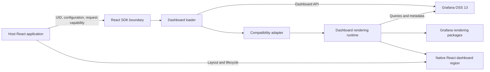

# Architecture Overview

## Status

This document describes the initial architecture hypothesis. It is not an implemented design or a stable public API. Research and proof-of-concept results must validate it.

## Objective

Render an existing Grafana OSS 13 dashboard, selected by UID, inside a host React application without an iframe, the Grafana web application shell, Grafana navigation, or an SDK-provided backend.

## System context

The host application owns routing, page layout, authentication decisions, and product chrome. The SDK owns a contained dashboard-rendering region. An existing Grafana instance remains the source of dashboard definitions and, where required, the gateway for data-source queries.

The arrows represent responsibilities to validate, not finalized modules or APIs.

## Initial component hypothesis

### React integration boundary

Accepts the dashboard UID and host-provided configuration, participates in React mount/update/unmount behavior, and reports loading or failure states without assuming application routing.

### Request boundary

Uses a host-configured, authorization-aware request capability to communicate with Grafana. The SDK should not own credentials or require a server component. Direct browser connectivity, CORS, cookies, tokens, and Grafana deployment topology are integration concerns that must be documented.

### Dashboard loader

Retrieves a dashboard definition by UID and preserves enough response metadata to support rendering and compatibility diagnostics. It should provide cancellation and avoid stale results when the UID changes.

### Compatibility adapter

Contains version-specific translation and service wiring between the SDK contract and Grafana's frontend models. This boundary should prevent Grafana internals from leaking into the eventual public API.

### Rendering runtime

Creates and disposes the dashboard scene or equivalent rendering model, coordinates time range and variables, and renders panels as React content. Grafana-maintained packages are preferred when their external use is technically and legally viable.

### Host integration

Keeps theme, size, error presentation, observability, and optional controls explicit. The SDK must not install global navigation or silently take ownership of the host page.

## Data flow hypothesis

1. The host mounts the SDK boundary with a dashboard UID and integration configuration.
2. The loader requests the matching dashboard definition from the configured Grafana instance.
3. The compatibility layer validates and adapts the response for the selected Grafana version.
4. The rendering runtime initializes the dashboard model and required Grafana services.
5. Panels issue queries through supported Grafana runtime paths and render within the host's React tree.
6. UID or configuration changes cancel obsolete work and rebuild only the necessary runtime state.
7. Unmounting disposes subscriptions, timers, requests, and rendering state.

## Architectural boundaries

- No iframe is permitted as a rendering path or fallback.
- No Grafana application shell, routes, or navigation are initialized.
- No backend is shipped by this project.
- Authentication material remains under host control.
- Grafana internals are isolated behind an adapter wherever practical.
- Unsupported dashboard features must produce actionable diagnostics.

## Cross-cutting concerns

### Compatibility

Compatibility must be stated against exact Grafana and SDK versions. Built-in panels, external plugins, transformations, variables, annotations, and data-source behavior need separate evidence.

### Styling and isolation

Research must determine required global CSS, theme providers, portals, fonts, and style collision risks. The SDK should minimize global side effects, but fidelity requirements may constrain isolation options.

### Security

The SDK must not weaken Grafana authorization. Dashboard and data access remain subject to the configured Grafana instance and credentials. Sensitive configuration must not be logged or embedded in published examples.

### Failure handling

The eventual contract should distinguish configuration, authorization, connectivity, compatibility, dashboard-not-found, plugin, and panel-query failures. One panel failure should not automatically make the entire host application unusable.

## Validation gates

The research documents define what must be learned before a public API is designed. The rendering POC is the primary architecture gate. Its outcome may confirm this component model, require a narrower compatibility target, or show that the project constraints cannot be satisfied with acceptable cost.

## Related decisions

- [ADR-001: No iframe rendering](decisions/ADR-001-no-iframe-rendering.md)
- [ADR-002: Frontend-only SDK](decisions/ADR-002-frontend-only-sdk.md)
- [ADR-003: Prefer Grafana-native rendering](decisions/ADR-003-grafana-native-rendering.md)
