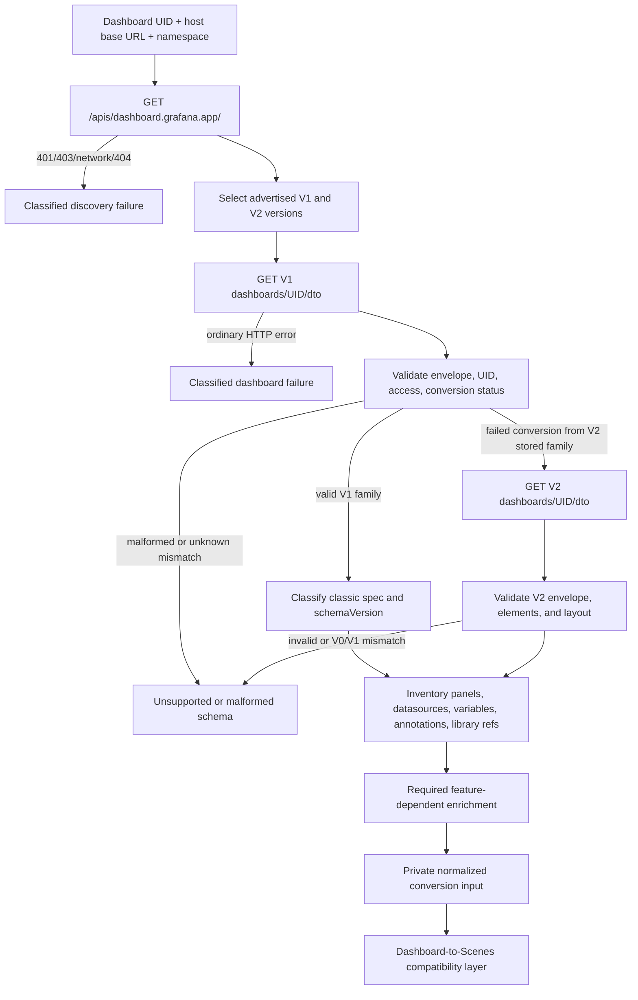

# Dashboard JSON/API Investigation

Related documents:

- `docs/project/project-context.md`
- `docs/architecture/architecture-overview.md`
- `docs/architecture/research/phase0-research-plan.md`
- `docs/architecture/research/grafana-source-map.md`
- `docs/architecture/research/grafana-scenes-investigation.md`
- `docs/architecture/research/grafana-data-investigation.md`
- `docs/architecture/research/grafana-ui-investigation.md`
- `docs/architecture/research/grafana-runtime-investigation.md`
- `docs/architecture/decisions/`

## Document metadata

| Field | Value |
| --- | --- |
| Workstream | Phase 0, Workstream 6: Dashboard JSON/API investigation |
| Status | Completed static source and official-documentation investigation; live POC validation remains required |
| Research date | 2026-10-03 |
| Grafana baseline | Grafana OSS `v13.2.3` at `6193dc03311b631b9727b560d24369e683dc396e` |
| Package baseline | `@grafana/data@13.2.3`, `@grafana/ui@13.2.3`, `@grafana/runtime@13.2.3`, `@grafana/schema@13.2.3`, `@grafana/scenes@8.13.5` |
| Overall conclusion | A browser SDK can retrieve a dashboard without a project-owned backend when the host supplies the Grafana base URL, namespace, and authenticated request capability. The POC should discover stable dashboard API versions, request the V1 DTO first, and request the V2 DTO only after a conversion-status mismatch. Authentication, origin policy, and any proxy remain host-owned. |

## Scope and evidence method

This investigation traces the browser-facing dashboard-by-UID contract at the pinned baseline. It covers discovery, V1 and V2 DTO responses, the legacy endpoint, schema classification, conditional enrichment, browser security, errors, and reload semantics. It does not implement a client or run a live Grafana instance.

Evidence was collected from:

- Grafana source and tests at the exact `v13.2.3` tag;
- generated V1 and V2 API types and registration code;
- Grafana's dashboard API clients and dashboard-to-Scenes conversion paths;
- server handlers and integration tests for both new and legacy endpoints; and
- official Grafana HTTP API, API-structure, authentication, and configuration documentation.

Findings use these labels:

- **Verified fact**: directly supported by pinned source, tests, generated API definitions, or official documentation.
- **Inference**: a proposed SDK behavior derived from verified facts but not yet exercised in an independent browser host.
- **Open question**: requires a controlled Grafana OSS 13.2.3 instance or later workstream.

## Executive finding

Grafana OSS 13.2.3 exposes the dashboard resource through the Kubernetes-style `dashboard.grafana.app` API group. The relevant browser flow is:

1. discover versions with `GET /apis/dashboard.grafana.app/`;
2. select the advertised stable V1 and V2 versions independently;
3. request `GET /apis/dashboard.grafana.app/{v1}/namespaces/{namespace}/dashboards/{uid}/dto`;
4. inspect the resource envelope and `status.conversion`;
5. request the equivalent V2 DTO only when the V1 conversion status says the stored dashboard belongs to the V2 family;
6. classify and validate the returned schema; and
7. perform only feature-dependent enrichment before passing a normalized, private value to the dashboard-to-Scenes compatibility layer.

The `/dto` subresource is preferable to the raw resource because it adds the current user's dashboard and annotation permissions. It does not contain datasource instances, plugin modules, annotation events, library-panel definitions, or the results of variable queries. Those are runtime dependencies, not part of the dashboard retrieval response.

The legacy `GET /api/dashboards/uid/{uid}` endpoint still works at this baseline, but it is explicitly deprecated in the handler and Grafana 13 documentation. It should not be an automatic fallback: falling back after a new-API authorization, network, or version error would hide the real deployment problem and create a second contract to maintain.

## Exact baseline and terminology

### Baseline

**Verified fact.** Grafana OSS tag `v13.2.3` resolves to commit `6193dc03311b631b9727b560d24369e683dc396e`. This is the same baseline established in Workstream 1 and used by the package investigations.

### Three different version concepts

The compatibility layer must not collapse these fields into one value:

| Concept | Example | Meaning |
| --- | --- | --- |
| API version | `dashboard.grafana.app/v1` or `dashboard.grafana.app/v2` | Wire schema requested from the API server |
| Classic dashboard schema version | V1 `spec.schemaVersion: 41` | Migration level of the classic dashboard JSON model |
| Resource revision | `metadata.generation: 7`, `metadata.resourceVersion: "..."` | Saved-spec generation and broader resource change token |

**Verified fact.** `metadata.generation` changes only when `spec` changes, while `metadata.resourceVersion` changes when any part of the resource changes. The URL identity is `metadata.name`; `metadata.uid` is an internal resource identifier and is not the Grafana dashboard UID used in the route.

## Dashboard API surface

### API group discovery

**Verified fact.** [`getAPIGroupVersions`](https://github.com/grafana/grafana/blob/v13.2.3/public/app/features/apiserver/discovery.ts) sends:

```http
GET /apis/dashboard.grafana.app/
```

The response is a Kubernetes-style API-group object containing `versions[]` and `preferredVersion`. The frontend returns `undefined` for a 404 group response and propagates other errors. Grafana also has aggregated discovery at `GET /apis`, but the pinned dashboard resolver uses the group-specific endpoint.

**Verified fact.** [`DashboardAPIVersionResolver`](https://github.com/grafana/grafana/blob/v13.2.3/public/app/features/dashboard/api/DashboardAPIVersionResolver.ts) resolves the two schema families separately:

- for the V1 family, use a preferred `v1` or `v1beta1`; otherwise choose advertised `v1`, then `v1beta1`;
- for the V2 family, use a preferred `v2` or `v2beta1`; otherwise choose advertised `v2`, then `v2beta1`;
- cache a successful result and coalesce concurrent discovery calls; and
- on any discovery error, use beta versions for that call but do not cache the failure.

The accompanying [resolver tests](https://github.com/grafana/grafana/blob/v13.2.3/public/app/features/dashboard/api/DashboardAPIVersionResolver.test.ts) verify preferred-version handling, stable scanning, beta fallback, retry, cache, and in-flight deduplication.

**Inference.** The standalone SDK should reuse the negotiation idea but not Grafana's fail-open beta fallback. A CORS failure, expired session, missing group, and temporary network failure are materially different. The SDK should surface discovery failure and use a beta version only when discovery succeeds and explicitly advertises only that beta family.

### Registered dashboard versions

**Verified fact.** The pinned server registers dashboard resources and the `dashboards/dto` subresource for `v0alpha1`, `v1beta1`, `v1`, `v2alpha1`, `v2beta1`, and `v2` in [`pkg/registry/apis/dashboard/register.go`](https://github.com/grafana/grafana/blob/v13.2.3/pkg/registry/apis/dashboard/register.go). The generated application manifest declares `PreferredVersion: "v1"` in [`apps/dashboard/pkg/apis/dashboard_manifest.go`](https://github.com/grafana/grafana/blob/v13.2.3/apps/dashboard/pkg/apis/dashboard_manifest.go).

The builder's scheme priority starts with V2, whereas the generated manifest says V1 is preferred. These values serve different registration paths, so the browser must treat the discovery response from the target server as authoritative rather than infer preference from source ordering.

### V1 endpoint

**Verified fact.** The raw and DTO forms are:

```http
GET /apis/dashboard.grafana.app/v1/namespaces/{namespace}/dashboards/{uid}
GET /apis/dashboard.grafana.app/v1/namespaces/{namespace}/dashboards/{uid}/dto
```

The official [Dashboard HTTP API documentation](https://grafana.com/docs/grafana/latest/developer-resources/api-reference/http-api/dashboard/) documents the stable V1 endpoint, the DTO subresource, `dashboards:read`, and 200/401/403/404 outcomes. The source-based client uses the discovered `v1` or `v1beta1`, not a hard-coded path.

### V2 endpoint

**Verified fact.** Stable V2 is registered at the pinned tag with the same resource and DTO shape:

```http
GET /apis/dashboard.grafana.app/v2/namespaces/{namespace}/dashboards/{uid}
GET /apis/dashboard.grafana.app/v2/namespaces/{namespace}/dashboards/{uid}/dto
```

The V2 contract is supported by the generated [`v2` types](https://github.com/grafana/grafana/blob/v13.2.3/apps/dashboard/pkg/apis/dashboard/v2/), its registration in `register.go`, and Grafana's [`K8sDashboardV2API`](https://github.com/grafana/grafana/blob/v13.2.3/public/app/features/dashboard/api/v2.ts). The official dashboard page directs readers to the V2 Swagger definition for the newest endpoint schema rather than fully reproducing V2 in the prose page.

### DTO subresource behavior

**Verified fact.** [`DTOConnector`](https://github.com/grafana/grafana/blob/v13.2.3/pkg/registry/apis/dashboard/sub_dto.go) is GET-only and describes the DTO as everything the Grafana UI needs in a single dashboard request. It:

- loads the requested dashboard resource;
- rejects callers without dashboard read access;
- batch-checks dashboard update, delete, and permission-administration capabilities;
- checks create, update, and delete permissions for dashboard annotations;
- derives `slug` and `url`;
- determines whether a public dashboard exists; and
- returns the version-specific dashboard wrapper plus `access`.

Passing `includeAccess=false` returns the raw dashboard resource. The POC should omit this parameter and retain `access`, because permissions are useful for correct read-only behavior even when editing is outside the initial scope.

The server integration test [`pkg/tests/apis/dashboard/dashboards_test.go`](https://github.com/grafana/grafana/blob/v13.2.3/pkg/tests/apis/dashboard/dashboards_test.go) retrieves V0-, V1-, and V2-stored dashboards through each API client and through `/dto`. It also verifies that legacy-only `id`, `uid`, and `version` fields are removed from `spec`, and that the DTO contains derived access data.

### Legacy endpoint

**Verified fact.** The legacy endpoint is:

```http
GET /api/dashboards/uid/{uid}
```

[`pkg/api/dashboard.go`](https://github.com/grafana/grafana/blob/v13.2.3/pkg/api/dashboard.go) marks the operation deprecated and points callers to the stable V1 resource endpoint. It returns the older `{ dashboard, meta }` `DashboardFullWithMeta` response and performs legacy folder, provisioning, public-dashboard, and access enrichment.

Grafana's [API structure documentation](https://grafana.com/docs/grafana/latest/developer-resources/api-reference/http-api/apis/) states that Grafana 13 deprecates `/api` endpoints in favor of `/apis`; legacy APIs remain enabled for now and are planned for removal in a future major release.

**Decision.** Do not use the legacy route in the initial POC and do not silently fall back to it. Retain it only as a documented diagnostic comparison or a future, explicit compatibility mode if real deployments require it.

## Namespace and UID contract

**Verified fact.** New API paths are namespaced. Official API structure documentation defines:

| Deployment | Namespace form |
| --- | --- |
| OSS/on-premises organization 1 | `default` |
| OSS/on-premises additional organization | `org-{ORG_ID}` |
| Grafana Cloud | `stacks-{STACK_ID}` |

The Grafana application obtains its namespace from boot configuration through `getAPINamespace()`. That application helper is not an appropriate standalone contract.

**Decision.** The host must supply or resolve the namespace explicitly. Defaulting to `default` is acceptable only as an opt-in convenience for a known single-organization OSS deployment; it is not universally correct.

### Dashboard identifier semantics

The pinned baseline uses the word `uid` for two different kinds of identifier. The compatibility layer must preserve the distinction:

| Identifier | Meaning in Grafana OSS 13.2.3 | SDK treatment |
| --- | --- | --- |
| Classic dashboard JSON `uid`, or V1 `spec.uid` where present | The user-facing Grafana dashboard UID. The classic schema describes it as the unique dashboard identifier. | Treat as the same logical identifier as `metadata.name`, but not as the canonical field in a new API response. |
| Resource `metadata.name` | The Grafana dashboard UID in the namespaced `/apis` resource model. Official documentation explicitly identifies it as the Grafana UID. | Canonical identifier after retrieval; validate it against the requested SDK `uid`. |
| V2 `spec.uid` | No top-level field exists in the pinned V2 `Spec`. | Do not expect or synthesize a V2 `spec.uid`; use `metadata.name`. |
| Resource `metadata.uid` | An opaque Kubernetes-style internal resource identifier assigned to the resource object. It is not the Grafana dashboard UID. | Preserve only as opaque metadata if needed; never accept it as the dashboard selector. |
| `/apis/.../dashboards/{identifier}/dto` path segment | The resource name, therefore the Grafana dashboard UID represented by `metadata.name`. | URL-encode the SDK `uid` into this segment. |

**Verified fact.** The pinned [API structure documentation](https://github.com/grafana/grafana/blob/v13.2.3/docs/sources/developer-resources/api-reference/http-api/apis.md) states that URL paths always use `metadata.name`, that `metadata.uid` is a different internal identifier, and that the latter is not the Grafana UID. The pinned [dashboard API documentation](https://github.com/grafana/grafana/blob/v13.2.3/docs/sources/developer-resources/api-reference/http-api/dashboard.md) calls `metadata.name` the Grafana unique identifier and says the dashboard UID route parameter is `metadata.name`, not `metadata.uid`.

**Verified fact.** Classic dashboard JSON still defines [`Dashboard.uid`](https://github.com/grafana/grafana/blob/v13.2.3/packages/grafana-schema/src/raw/dashboard/x/types.gen.ts) as the unique dashboard identifier. In the new V1 resource API, however, [`mutateDashboard`](https://github.com/grafana/grafana/blob/v13.2.3/pkg/registry/apis/dashboard/mutate.go) removes `uid` from `spec` during admission. The cross-version [dashboard API integration test](https://github.com/grafana/grafana/blob/v13.2.3/pkg/tests/apis/dashboard/dashboards_test.go) asserts that returned V0, V1, and V2 resource specs do not contain `uid`.

**Verified fact.** [`K8sDashboardAPI.getDashboardDTO`](https://github.com/grafana/grafana/blob/v13.2.3/public/app/features/dashboard/api/v1.ts) reconstructs legacy `dashboard.uid` from `dash.metadata.name`; its [test](https://github.com/grafana/grafana/blob/v13.2.3/public/app/features/dashboard/api/v1.test.ts) explicitly verifies this behavior. On save, the same client maps an existing classic `dashboard.uid` back to `metadata.name`. The V2-to-Scenes path similarly assigns the scene UID from [`metadata.name`](https://github.com/grafana/grafana/blob/v13.2.3/public/app/features/dashboard-scene/serialization/transformSaveModelSchemaV2ToScene.ts).

**SDK contract.** In:

```tsx
<GrafanaDashboard uid="production-overview" />
```

`uid` must mean the user-facing Grafana dashboard UID: the value represented by classic dashboard JSON `dashboard.uid` and by new-API `metadata.name`. The SDK must use that value in `/apis/dashboard.grafana.app/{version}/namespaces/{namespace}/dashboards/{uid}/dto` and verify that the response has the same `metadata.name`. It must not represent `metadata.uid`, a numeric legacy dashboard ID, a title, or a slug.

## Response contracts

### Common resource envelope

The raw resource and DTO share this conceptual envelope:

```text
apiVersion: dashboard.grafana.app/{version}
kind: Dashboard | DashboardWithAccessInfo
metadata:
  name: dashboard UID used in the URL
  namespace: API namespace
  uid: internal resource UID
  resourceVersion: change/concurrency token
  generation: saved spec generation
  creationTimestamp: RFC 3339 timestamp
  annotations: folder, creator, updater, provisioning, and other metadata
  labels: optional resource labels
spec: version-specific dashboard definition
status:
  conversion:
    failed: boolean
    storedVersion: original stored API version
    error: optional conversion error
access: present on the DTO response
```

The generic frontend resource contract is in [`public/app/features/apiserver/types.ts`](https://github.com/grafana/grafana/blob/v13.2.3/public/app/features/apiserver/types.ts). Generated conversion status types explain that `storedVersion` is the version whose retrieval should succeed when conversion fails.

### Access block

**Verified fact.** Both generated V1 and V2 `DashboardWithAccessInfo` types contain the same server-side fields:

| Field | Meaning |
| --- | --- |
| `slug`, `url` | Derived Grafana route metadata |
| `isPublic` | Whether a public dashboard exists |
| `canSave`, `canEdit` | Update permission |
| `canDelete` | Delete permission |
| `canAdmin` | Permission-administration capability |
| `canStar` | True for an authenticated user identity |
| `annotationsPermissions.dashboard` | `canAdd`, `canEdit`, and `canDelete` |

The frontend TypeScript interface also contains optional `canShare`, but the pinned Go response types do not define or populate it. The compatibility layer must not require `canShare`.

### Folder information

**Verified fact.** Folder membership is carried by the `grafana.app/folder` metadata annotation. Root dashboards may have an absent, empty, or `general` value. The DTO does not embed the folder resource's title or display URL.

The V1 and V2 frontend clients optionally call `getFolderByUidFacade` after DTO retrieval. They continue without title/URL when the folder request returns 403, but report other folder lookup failures. This enrichment serves Grafana UI presentation and navigation; it is not required to deserialize or render the dashboard.

The documented stable lookup is `GET /apis/folder.grafana.app/v1/namespaces/{namespace}/folders/{folderUid}`. The pinned Grafana facade can instead use `v1beta1` according to application feature configuration, which is another reason not to copy that facade directly into the SDK.

**Decision.** Preserve the folder UID annotation. Do not make folder lookup part of the POC's critical retrieval path. If a future public SDK feature exposes folder presentation, request the folder through the `folder.grafana.app` API behind an adapter and treat denied or missing folder metadata as non-fatal to dashboard rendering.

### Revision information

**Verified fact.** For a resource response:

- `metadata.generation` is the saved dashboard spec revision;
- `metadata.resourceVersion` covers changes to the complete resource and is suitable for change detection and optimistic concurrency;
- `metadata.creationTimestamp` records creation;
- `grafana.app/updatedTimestamp` may record the last update; and
- V2 `spec.revision` is plugin-dashboard provenance and is not the saved resource generation.

Grafana's V1 frontend adapter injects `metadata.generation` into legacy `dashboard.version` and `meta.version`. The SDK should retain the original metadata values rather than rely only on those compatibility projections.

## V1 dashboard definition

**Verified fact.** V1 `spec` is the classic Grafana dashboard JSON model. Relevant fields include:

- numeric `schemaVersion`;
- flat `panels` with legacy IDs and `gridPos`;
- `templating.list` variables;
- `annotations.list` annotation queries;
- dashboard `time`, `timepicker`, and `timezone` settings;
- links, tags, refresh settings, and editable state; and
- panel plugin IDs, datasource references, targets, transformations, options, and field configuration.

[`K8sDashboardAPI.getDashboardDTO`](https://github.com/grafana/grafana/blob/v13.2.3/public/app/features/dashboard/api/v1.ts) maps the new resource wrapper to Grafana's legacy `DashboardDTO` by combining `spec`, `metadata`, and `access`. This mapping injects UID and generation, maps provisioning annotations, and optionally enriches folder presentation data.

**Verified fact.** The dashboard-to-Scenes V1 path constructs a legacy `DashboardModel` specifically so Grafana's client migrations run before building the scene. The path lives in [`transformSaveModelToScene.ts`](https://github.com/grafana/grafana/blob/v13.2.3/public/app/features/dashboard-scene/serialization/transformSaveModelToScene.ts), outside the published Grafana packages.

**Implication.** A valid V1 HTTP response is not sufficient by itself. The compatibility layer must supply an equivalent, pinned migration and conversion path before Scenes construction. `spec.schemaVersion` must be validated separately from the API version.

## V2 dashboard definition

**Verified fact.** V2 `spec` is structurally distinct. Its generated contract includes:

- `elements`, a map of inline panels or library-panel references;
- a discriminated `layout` supporting grid, rows, auto-grid, and tabs;
- `variables` as typed variable kinds;
- `annotations` as typed annotation queries;
- `timeSettings`, links, tags, cursor synchronization, and preferences; and
- panel visualization, query, transformation, options, and field configuration data within elements.

The exact generated contract is in [`apps/dashboard/pkg/apis/dashboard/v2/dashboard_spec_gen.go`](https://github.com/grafana/grafana/blob/v13.2.3/apps/dashboard/pkg/apis/dashboard/v2/dashboard_spec_gen.go) and the matching published schema package.

**Verified fact.** [`transformSaveModelSchemaV2ToScene`](https://github.com/grafana/grafana/blob/v13.2.3/public/app/features/dashboard-scene/serialization/transformSaveModelSchemaV2ToScene.ts) consumes the V2 wrapper directly and delegates layout creation to application-owned deserializers. It does not use the legacy `DashboardModel`, but the conversion and layout registry still live in unpublished Grafana application code.

**Implication.** V2 removes the classic model migration from the direct path, but does not eliminate compatibility work. The SDK must validate element kinds and layout discriminants, resolve library-panel references, and reproduce or adapt the application-owned V2-to-Scenes path.

## Conversion status and schema classification

### Upstream behavior

**Verified fact.** The server can convert between stored and requested versions. If conversion fails, the resource status reports `conversion.failed`, `conversion.storedVersion`, and an error. Grafana's [`UnifiedDashboardAPI`](https://github.com/grafana/grafana/blob/v13.2.3/public/app/features/dashboard/api/UnifiedDashboardAPI.ts) does the following for a normal load:

1. request the V1 DTO;
2. accept a valid V1-family result;
3. throw `DashboardVersionError` when the V1 DTO reports a failed conversion from a V2-stored dashboard; and
4. catch only that typed mismatch and retry with the V2 client.

It does not retry V2 after an ordinary HTTP, authorization, folder, or network error. V2 performs the mirror check for failed conversion from V0/V1 stored versions.

### Required classification rules

**Inference.** Before conversion, the SDK should validate at least:

1. response is a JSON object;
2. `apiVersion` has group `dashboard.grafana.app` and an expected discovered version;
3. `kind` is the DTO-compatible dashboard kind;
4. `metadata.name` equals the requested UID and `metadata.namespace` matches the request;
5. `metadata.resourceVersion` exists and `generation`, when present, is numeric;
6. `spec` is an object;
7. `access` is present for a DTO response; and
8. `status.conversion`, if present, has a recognizable stored version and failure shape.

Then classify the definition:

| Family | Positive indicators | Required handling |
| --- | --- | --- |
| V1/classic | V1-family `apiVersion`, numeric `spec.schemaVersion`, classic `panels`/`templating` shape | Run pinned classic migrations, then V1-to-Scenes conversion |
| V2 | V2-family `apiVersion`, typed `elements`, discriminated `layout`, `timeSettings`, typed variables | Run V2 validation and V2-to-Scenes deserialization |

Shape checks are defense in depth; they must not override a contradictory API version or failed conversion status. Contradictory metadata is a malformed/unsupported response, not permission to guess.

### Compatibility-layer input

**Inference.** The retrieval layer should pass a private normalized record containing the requested UID, namespace, selected family and exact API version, original `metadata`, `access`, `status.conversion`, untouched `spec`, and retrieval revision tokens. This is an internal architecture contract, not a proposed public TypeScript API.

Grafana-specific resource types should remain behind the versioned compatibility layer. The future public SDK surface needs only host-oriented configuration and dashboard load/render state.

## Dashboard conversion prerequisites

| Input or service | V1 path | V2 path | Source | POC disposition |
| --- | --- | --- | --- | --- |
| DTO `spec` | Classic dashboard definition | Typed dashboard definition | DTO response | Required |
| `metadata.name` and generation | Inject UID and legacy version | Scene UID/version metadata | DTO response | Required |
| `access` | Legacy meta and read-only behavior | Scene meta/access | DTO response | Required |
| Conversion status | Detect V2-stored mismatch | Detect V0/V1-stored mismatch | DTO response | Required |
| Folder UID | Preserve dashboard location context | Preserve dashboard location context | Metadata annotation | Preserve; no display lookup required |
| Classic migration engine | Run migrations through current schema | Not used directly | Application-owned `DashboardModel` path | Compatibility-layer requirement |
| Layout deserializers | Legacy grid/row conversion | V2 layout registry | Application-owned scene serialization | Compatibility-layer requirement |
| Panel plugin loader | Resolve every panel plugin ID | Resolve every visualization kind | Runtime/application plugin infrastructure | Required for supported panels |
| Datasource resolver | Resolve target and variable datasource references | Resolve query kinds/datasource references | Runtime/application datasource infrastructure | Required for data-backed panels |
| Library-panel resolver | Resolve legacy library panel reference | Resolve `LibraryPanel` element reference | Separate library API | Conditional; unsupported in minimal POC |
| Theme/UI/runtime providers | Render the produced scene | Render the produced scene | Package and adapter workstreams | Required after retrieval |

## Follow-up and enrichment requests

The DTO is the complete dashboard-and-access response, not a complete rendering bundle. Follow-up work depends on features present in the definition.

### Request inventory

| Capability | Embedded in DTO? | Follow-up behavior at the pinned baseline | Rendering importance | Initial disposition |
| --- | --- | --- | --- | --- |
| Folder membership | UID annotation only | Optional folder resource lookup for title/access/parents | Not needed for panel rendering | Defer |
| Datasource references | UID/type references only | Resolve instance settings; current app can use `/api/frontend/settings` or `GET /api/datasources/uid/{uid}` | Required for queries and query variables | Adapt |
| Dashboard-local variables | Definitions embedded | Query/datasource variables execute datasource requests during activation/refresh | Required when referenced | Adapt |
| Global/folder predefined variables | Not embedded in dashboard | Feature-gated paginated V2 variable-resource list requests with label selectors | Conditional, new V2 feature | Defer from minimal POC |
| Annotation queries | Definitions embedded | Query live events; legacy path uses `GET /api/annotations`, newer path may use `annotation.grafana.app` plus legacy alert events | Conditional visual data | Defer or disable in minimal POC |
| Library panels | Reference only | `GET /api/library-elements/{uid}` returns the definition | Required if referenced | Reject dashboard in minimal POC; adapt later |
| Panel plugin metadata | Plugin ID/options only | Current app seeds/fetches panel metadata through boot data or `/api/frontend/settings` | Required for resolution and compatibility checks | Fixed POC catalog; adapt later |
| Panel plugin code/assets | Not embedded | Built-ins and external plugins load through Grafana application import infrastructure | Required | Blocker outside supported POC catalog |
| Datasource plugin code/assets | Not embedded | Runtime resolves and imports the datasource plugin module | Required for its queries/resources | Blocker outside supported POC datasource path |
| Datasource query | No result data embedded | Usually `POST /api/ds/query`; plugin-specific paths may differ | Required for data-backed panels | Adapt |
| Datasource resources | Not embedded | `/api/datasources/uid/{uid}/resources/*` where a plugin uses resources | Conditional | Defer until representative datasource requires it |
| Grafana Live | No stream data embedded | WebSocket/live channel negotiated separately | Conditional | Reject from minimal POC; investigate later |

### Datasource metadata

**Verified fact.** Dashboard JSON contains datasource references but not the full datasource instance configuration. Grafana's runtime normally initializes datasource settings from boot configuration and can refresh frontend settings through `/api/frontend/settings`. The documented datasource lookup `GET /api/datasources/uid/{uid}` returns browser-safe settings while secret values remain omitted and `secureJsonFields` reports configured secrets.

**Inference.** Per-UID lookup minimizes unrelated configuration exposure, while frontend settings most closely reproduces Grafana's boot catalog and includes default datasource and panel metadata. The POC should select the narrowest request compatible with its representative datasource and record which fields its adapter consumes.

### Variables

**Verified fact.** V1 local variable definitions are in `templating.list`; V2 local definitions are in `variables`. Query variables and datasource variables still require runtime datasource resolution and network requests.

New V2 predefined global/folder variables are separate `dashboard.grafana.app` variable resources. [`fetchPredefinedVariables`](https://github.com/grafana/grafana/blob/v13.2.3/public/app/features/dashboard-scene/utils/predefinedVariables.ts) lists them with label selectors, paginates in groups of 500, applies folder-over-global name precedence, and caches them for 30 seconds. The feature depends on an internal feature-flag client.

**Decision.** The minimal POC should use dashboard-local variables only. Predefined variables are a later compatibility feature because they add API requests, feature-flag semantics, and app-only code.

### Annotations

**Verified fact.** Annotation query definitions are part of both schemas, but event data is loaded separately. [`public/app/features/annotations/api.ts`](https://github.com/grafana/grafana/blob/v13.2.3/public/app/features/annotations/api.ts) uses `GET /api/annotations` by default. A feature-gated Kubernetes client can query the annotation API, while alert-state annotations remain on the legacy endpoint. Official [Annotations API documentation](https://grafana.com/docs/grafana/latest/developer-resources/api-reference/http-api/api-legacy/annotations/) identifies the query parameters and permissions.

**Decision.** The POC may suppress annotation execution while preserving definitions, provided it reports this limitation. Annotation support should later sit behind the query/runtime compatibility boundary rather than dashboard retrieval.

### Library panels

**Verified fact.** V2 can contain a `LibraryPanel` element with a reference instead of an inline panel definition. Grafana's [`LibraryPanelBehavior`](https://github.com/grafana/grafana/blob/v13.2.3/public/app/features/dashboard-scene/scene/LibraryPanelBehavior.tsx) activates by loading the referenced library element, constructing a legacy panel model, and replacing the scene panel's plugin, options, and query provider. [`state/api.ts`](https://github.com/grafana/grafana/blob/v13.2.3/public/app/features/library-panels/state/api.ts) calls `GET /api/library-elements/{uid}` and runs application-owned migrations.

**Decision.** The minimal POC should declare library-panel dashboards unsupported and fail with a feature-specific diagnostic before scene activation. Production support requires a dedicated resolver and migration adapter.

### Panel and datasource plugins

**Verified fact.** Neither DTO variant transports executable plugin code. Current Grafana seeds plugin metadata from `window.grafanaBootData` and `/api/frontend/settings`, then uses application-owned import utilities and SystemJS/import-map behavior. The Runtime workstream found those concrete loaders are not published as a supported standalone initializer.

**Decision.** Dashboard retrieval may inventory plugin and datasource IDs, but cannot make them renderable. The initial POC must use an explicit supported catalog and let Workstream 7 classify every module and asset dependency.

## Browser authentication and deployment

### Ownership boundary

Authentication is outside the SDK. The host supplies an authenticated request capability or deploys the application where browser credentials already work. The SDK must not:

- accept or persist a service-account secret as ordinary browser configuration;
- embed Basic credentials or bearer tokens in bundles, examples, fixtures, logs, or URLs;
- implement login, token refresh, organization selection, or an authentication backend; or
- weaken Grafana's origin, CSRF, or cookie policies.

Official [HTTP API authentication documentation](https://grafana.com/docs/grafana/latest/developer-resources/api-reference/http-api/authentication/) supports Basic authentication and service-account bearer tokens for non-browser API clients and describes optional `X-Grafana-Org-Id`. Those mechanisms do not make long-lived secrets safe in a public browser bundle.

### Cookie, origin, and CSRF facts

**Verified fact.** Grafana's pinned defaults set `cookie_samesite = lax` and `cookie_secure = false`. Official [configuration documentation](https://grafana.com/docs/grafana/latest/setup-grafana/configure-grafana/) says `cookie_samesite` can be `lax`, `strict`, `none`, or `disabled`, and recommends `cookie_secure = true` when Grafana is hosted behind HTTPS.

**Verified fact.** [`pkg/middleware/csrf/csrf.go`](https://github.com/grafana/grafana/blob/v13.2.3/pkg/middleware/csrf/csrf.go) performs an origin check when the login cookie is present. Its safe-method list contains `HEAD`, `OPTIONS`, and `TRACE`, but deliberately excludes `GET`; therefore cross-origin dashboard discovery and DTO GETs can be rejected by CSRF validation. `csrf_trusted_origins` and `csrf_additional_headers` can influence this check. They do not by themselves supply browser CORS response headers.

**Verified fact.** The documented `live.allowed_origins` setting applies to the Grafana Live WebSocket upgrade, not the general HTTP API.

**Inference.** Direct cross-origin cookie deployment requires all of the following to align: cookie SameSite/Secure attributes, credentialed CORS at Grafana or an upstream gateway, Grafana CSRF trusted-origin behavior, and HTTPS. Grafana's documented core configuration does not present a general-purpose REST CORS switch. A host-owned same-origin reverse proxy is the lower-risk POC topology.

### Authentication and deployment matrix

| Topology | Browser credential model | Required deployment work | POC status |
| --- | --- | --- | --- |
| Host app and Grafana on the same origin/path space | Existing Grafana session cookie with same-origin requests | Route Grafana API paths without collisions; preserve cookies and Grafana subpath | Recommended |
| Host app uses a same-origin reverse proxy to Grafana | Host/Grafana session managed by deployment | Proxy `/apis`, required `/api` calls, assets, and later Live if needed; preserve headers and cookies | Recommended when origins otherwise differ |
| Direct cross-origin request with Grafana session cookie | `credentials: include` | Exact credentialed CORS, trusted CSRF origin, compatible SameSite cookie, Secure cookie, HTTPS | Investigate; not POC default |
| Direct cross-origin request with host-supplied bearer | Host owns a short-lived credential and request function | CORS and HTTPS; strict token lifecycle and no SDK persistence | Possible integration, explicitly host-owned; not default |
| Long-lived service-account or Basic secret in browser code | Static secret | Secret is visible to users and tooling | Reject |
| Anonymous Grafana access | No browser secret | Grafana administrator intentionally enables and scopes anonymous access | Supported deployment choice, not an SDK assumption |

Same-site and same-origin are not synonyms. Two subdomains can be same-site for cookie rules while still cross-origin for Fetch/CORS and Grafana origin validation.

## Error classification

The retrieval layer must classify failures by stage so consumers can distinguish content errors from deployment errors.

| Error class | Evidence/signals | SDK treatment |
| --- | --- | --- |
| Cancelled/superseded | Abort signal, UID changed, component unmounted | End silently or report a non-error cancelled state; never replace newer state |
| Network/origin failure | Fetch rejection, timeout, DNS/TLS failure, opaque browser CORS error | `network`; preserve safe diagnostic context; do not label unauthorized |
| Unauthenticated | HTTP 401 | `unauthorized`; host must establish authentication |
| Forbidden | HTTP 403 | `forbidden`; preserve whether discovery, dashboard, folder, or follow-up failed |
| Dashboard not found | 404 from the selected dashboard resource stage | `not-found` for the requested UID |
| API group unavailable | 404 from `/apis/dashboard.grafana.app/` | `unsupported-api` or deployment mismatch, not dashboard-not-found |
| Unsupported API version | Discovery succeeds but no accepted V1/V2 version is advertised, or endpoint rejects selected version | `unsupported-api-version` with advertised versions |
| Schema/conversion incompatibility | `status.conversion.failed`, unknown stored family, unsupported V1 `schemaVersion`, unknown V2 kind/layout | `unsupported-dashboard-schema`; try V2 only for the recognized V2-stored mismatch |
| Malformed response | 2xx with invalid JSON/envelope, UID/namespace mismatch, absent `spec`/DTO access, contradictory family/shape | `malformed-response`; never pass to conversion |
| Follow-up unsupported | Library panel, unknown plugin/datasource, or disabled feature detected | Feature-specific `unsupported-dependency` before partial activation |
| Server failure | 5xx not safely attributable to the pinned not-found bug | `server-error`; retain status/request stage and safe message |

**Verified fact.** Both pinned dashboard clients contain a workaround for an API-server bug that may return a non-404 status with a message containing `not found`; they normalize it to 404. This string-based behavior is application code, not a server contract.

**Decision.** Preserve raw HTTP status and request stage. If the POC reproduces the pinned workaround, constrain it to the exact known error shape and record both original and normalized categories. Never use a broad `message.includes("not found")` rule across arbitrary proxy or server errors.

No error except a recognized conversion-family mismatch should cause a V1-to-V2 retry. No new-API error should automatically invoke the legacy endpoint.

## Caching, revisions, and safe reload

### Upstream behavior

**Verified fact.** The version resolver caches successful discovery for the page lifetime and retries after failed discovery. The Grafana dashboard page state manager has a deliberately short 500 ms DTO cache keyed by its load key. That cache is an application optimization, not an HTTP API guarantee.

**Verified fact.** The dashboard-specific handlers inspected here do not set an ETag or implement conditional-request behavior, and the official dashboard API documentation does not promise ETag or `If-None-Match` support.

**Open question.** The generic API-server stack may add response cache headers or validators in a deployed build. The POC must capture real response headers before making a production cache policy. Until then, `resourceVersion` and `generation` are application-level change tokens, not assumed HTTP validators.

### Recommended POC reload rules

1. Cache successful API-group discovery per `(base URL, namespace/auth context)` for the runtime lifetime.
2. Do not cache discovery failures.
3. Abort the previous dashboard and follow-up requests when UID, base URL, namespace, or host auth context changes.
4. Attach a monotonically increasing local load ID; only the newest load may publish state.
5. Validate every fresh DTO before replacing the active normalized dashboard.
6. Compare `metadata.resourceVersion` for any resource change and `metadata.generation` for spec changes.
7. Do not serve a previously authorized cached dashboard after a 401 or 403 without an explicit host policy.
8. If refresh fails, the UI may keep the already-rendered dashboard visibly marked stale, but must report the failure and must not claim the stale value is current.
9. Do not infer cacheability from the 500 ms application cache or synthesize HTTP conditional headers from `resourceVersion`.

## Security requirements

The investigation confirms the existing project constraints:

- no service-account, Basic-auth, or long-lived bearer secrets in browser bundles;
- no SDK-owned login, token store, authentication proxy, or backend;
- no cookies, authorization headers, raw response bodies, or private dashboard JSON in logs;
- no sensitive dashboard exports or authenticated fixtures committed to the repository;
- no automatic credential forwarding to a base URL that the host did not explicitly configure;
- HTTPS for any authenticated non-local deployment;
- strict URL construction and encoded path segments for namespace and UID; and
- sanitization or host policy for dashboard-defined external links, text/HTML content, plugin assets, and datasource resource URLs in later workstreams.

The SDK should accept a host-owned request function or narrowly scoped transport abstraction, not a password or permanent token configuration field.

## Versioned request/response map



The full resource path used by the V1 and V2 nodes is:

```text
{grafanaBaseUrl}/apis/dashboard.grafana.app/{selectedVersion}/
namespaces/{namespace}/dashboards/{encodedUid}/dto
```

`grafanaBaseUrl` must include any configured Grafana application subpath. The transport owns URL joining so the SDK does not assume Grafana is hosted at `/`.

## Verified facts

- Grafana OSS 13.2.3 registers stable V1 and V2 dashboard resources and DTO subresources.
- The browser application discovers the `dashboard.grafana.app` group and independently resolves V1 and V2 families.
- The DTO subresource returns the resource plus access and annotation-permission information.
- Dashboard URL identity is `metadata.name`, not `metadata.uid`.
- V1 is classic dashboard JSON with its own numeric `schemaVersion`; V2 uses typed elements and layouts.
- Conversion failures identify `storedVersion`, allowing the client to fetch the appropriate family.
- Grafana's unified client starts with V1 and falls back to V2 only for a typed V2-stored conversion mismatch.
- Folder title/URL, datasource settings, plugin modules, annotation events, library-panel definitions, and query results are not all embedded in the DTO.
- The legacy dashboard-by-UID endpoint remains available but is deprecated in Grafana 13.
- Login-cookie requests are subject to the pinned CSRF origin check, including GET requests.
- The inspected dashboard APIs provide resource revision metadata but no documented ETag contract.

## Inferences

- A frontend-only POC can retrieve dashboard JSON without an SDK backend if the host provides a working authenticated browser transport and deployment topology.
- Stable versions advertised by discovery are safer POC defaults than copying Grafana's beta-on-any-error fallback.
- V1-first plus conversion-directed V2 retry minimizes duplicate requests and matches pinned application behavior.
- Folder presentation, annotations, predefined variables, Live, and library panels can be excluded from the minimal POC if unsupported features are detected and reported before activation.
- A same-origin path or host-managed reverse proxy is the least fragile authenticated browser deployment for the POC.
- Retrieval and schema normalization can be isolated from Grafana Runtime singleton initialization, although rendering follow-up requests eventually depend on that runtime boundary.

## Open questions

1. What exact `versions` order and `preferredVersion` does a stock Grafana OSS 13.2.3 server return from `/apis/dashboard.grafana.app/` under the chosen feature configuration?
2. Are stable V1 and V2 both enabled in a clean OSS 13.2.3 installation without feature-toggle changes?
3. What response headers, cache directives, and request IDs are present on discovery and DTO responses in the controlled deployment?
4. Does the known API-server not-found status bug reproduce in 13.2.3, and what exact response shape identifies it safely?
5. Which namespace should the POC host use, and can the host obtain it without depending on Grafana boot data?
6. Which narrow datasource metadata request is sufficient for the representative datasource: per-UID lookup or frontend settings?
7. Can the representative dashboard avoid library panels, predefined variables, annotations, Live, and external plugins while still testing all four target visualizations?
8. What CORS and CSRF behavior is observed in the actual intended deployment, including Grafana hosted under a subpath?
9. Does a host session remain valid for datasource POST requests through the same topology after the GET-only retrieval proof succeeds?
10. What dashboard-defined content and link sanitization is already performed by the chosen native panel modules, and what remains host policy?

## Recommended dashboard retrieval strategy for the POC

Adopt this bounded strategy:

1. Require the host to provide Grafana base URL, namespace, and an authenticated request capability. Do not accept permanent secrets.
2. Discover `dashboard.grafana.app` once per runtime and fail explicitly if the group or stable V1/V2 family needed by the dashboard is unavailable.
3. Prefer advertised stable `v1` and `v2`; do not fall back to beta after a failed discovery request.
4. Request the V1 `/dto` resource first with an abort signal and access data enabled.
5. Validate identity, envelope, version, revision, access, and conversion status before inspecting the spec.
6. Retry the V2 `/dto` resource only when V1 reports failed conversion from a recognized V2 stored version.
7. Keep the exact response resource private, inventory conditional dependencies, and reject unsupported features before scene activation.
8. Run V1 migrations or V2 deserialization only inside the pinned dashboard-to-Scenes compatibility layer.
9. Use same-origin or a host-managed same-origin reverse proxy for the first authenticated POC.
10. Exclude legacy endpoint fallback, library panels, predefined variables, annotations, Grafana Live, and arbitrary plugin loading from the minimal retrieval proof.

This recommendation is intentionally narrower than Grafana's full application loader. It validates the dashboard contract without pretending that retrieval alone resolves the rendering-runtime blockers identified in Workstream 5.

## Request/response sequence

| Step | Request or action | Success output | Failure rule |
| --- | --- | --- | --- |
| 1 | Host resolves base URL, namespace, and transport | Immutable request context | Configuration error before network |
| 2 | `GET /apis/dashboard.grafana.app/` | Advertised and preferred versions | Classify by discovery stage; no beta guess |
| 3 | Select accepted stable V1/V2 versions | Version pair tied to base URL/context | Unsupported API version |
| 4 | `GET .../{v1}/.../dashboards/{uid}/dto` | V1 DTO or conversion status | Ordinary errors stop |
| 5 | Validate V1 DTO | Classic definition and revisions | Malformed/unsupported schema |
| 6 | If and only if V2-stored mismatch: `GET .../{v2}/.../dto` | V2 DTO | Classify V2 error; no legacy fallback |
| 7 | Validate/classify V2 DTO | Typed definition and revisions | Malformed/unsupported schema |
| 8 | Inventory dependencies | Required datasource/plugin/library/variable/annotation set | Unsupported feature diagnostic |
| 9 | Perform approved required follow-ups | Enriched private conversion input | Attribute error to exact follow-up |
| 10 | Pass to compatibility layer | Versioned conversion input | Conversion error distinct from retrieval |

## V1/V2 compatibility implications

| Concern | V1 | V2 | SDK implication |
| --- | --- | --- | --- |
| Server API stability | Stable V1 registered and documented | Stable V2 registered; detailed schema primarily via Swagger/source | Discover, then pin exact accepted versions |
| Dashboard shape | Classic JSON | Typed elements/layout | Separate validators and adapters |
| Schema evolution | Numeric `schemaVersion` plus API version | API version and typed discriminants | Never conflate version axes |
| Client migration | Legacy `DashboardModel` migration required | No legacy model, but app-owned deserializers required | Both paths remain compatibility work |
| Layout | Panels/grid positions and rows | Grid/rows/auto-grid/tabs | Different conversion algorithms |
| Variables | `templating.list` | Typed `variables`, plus optional external predefined resources | Local variables supported first |
| Library panels | Legacy reference in panel model | Explicit `LibraryPanel` element | Separate resolver required in both paths |
| Cross-family storage | V1 request may fail conversion from V2 storage | V2 request may fail conversion from V0/V1 storage | V1-first, typed mismatch-directed fallback |
| Scene input | Legacy DTO after mapping and migration | Resource wrapper after validation | Normalize only at private boundary |

## Adopt/adapt/defer/reject classification

| Capability | Classification | Rationale |
| --- | --- | --- |
| `dashboard.grafana.app` group discovery | Adopt behind transport adapter | Public server API and necessary for version-safe routing |
| Advertised stable V1 and V2 endpoints | Adopt | Exact pinned server registers both; stable versions are preferred over beta |
| `/dto` subresource | Adopt | Supplies dashboard definition and access in one request |
| Raw dashboard resource endpoint | Defer | Useful for diagnostics but omits access needed by the candidate path |
| V1-first, conversion-directed V2 request | Adopt behind compatibility adapter | Matches pinned Grafana behavior and avoids broad fallback |
| Grafana's beta fallback on discovery failure | Reject | Conflates missing group, auth, CORS, and network failure with version selection |
| V1 schema validation and migrations | Adapt | Required application-owned behavior, not a published standalone API |
| V2 schema validation and layout deserialization | Adapt | Required application-owned behavior, not turnkey package functionality |
| Folder UID annotation | Adopt | Part of resource metadata and useful context |
| Folder title/URL/parents lookup | Defer | Navigation/presentation enrichment, not rendering-critical |
| Per-UID datasource settings or approved catalog request | Adapt | Required for data queries; host authentication and runtime ownership apply |
| Dashboard-local variable definitions | Adopt behind adapter | Embedded, but query execution depends on datasources/runtime |
| Global/folder predefined variables | Defer | Feature-gated external resources and internal flag dependency |
| Annotation query definitions | Adopt as inert configuration initially | Embedded and needed for later fidelity |
| Annotation event requests | Defer | Separate dynamic data path; not needed for first retrieval proof |
| Library-panel retrieval | Defer | Legacy endpoint plus app migrations; unsupported in minimal POC |
| Fixed representative panel/plugin catalog | Adopt for POC | Bounds module-loading risk for the next workstream |
| Arbitrary built-in/external plugin loading | Defer/blocker | DTO does not deliver code; current loaders are application-owned |
| Grafana Live follow-up | Reject for minimal POC | Separate WebSocket/origin/runtime scope |
| Legacy `/api/dashboards/uid/{uid}` default or fallback | Reject | Deprecated and unnecessary for the pinned baseline |
| Host-provided same-origin transport | Adopt | Preserves frontend-only constraint without SDK-owned auth |
| Host-managed reverse proxy deployment | Adopt as host option | Solves origin topology without making it an SDK backend |
| SDK-owned authentication or embedded service-account token | Reject | Violates security and frontend-only boundaries |
| `resourceVersion`/`generation` change detection | Adopt | Explicit resource metadata semantics |
| Assumed ETag/conditional GET support | Defer | Not documented or demonstrated for this endpoint |

## Standalone retrieval conclusion

Dashboard retrieval is feasible without the Grafana shell and without an SDK-owned backend. The contract is versioned, discoverable, and sufficiently self-describing to choose V1 or V2 and preserve access and revision metadata.

That conclusion is limited to retrieval and classification. Full native rendering still depends on unpublished migration/deserialization code, datasource and plugin resolution, and Runtime initialization identified by the preceding workstreams. Workstream 7 should use the normalized retrieval output and feature inventory defined here to determine whether the representative Time series, Stat, Table, and Text panels can cross that remaining boundary.

## Upstream source and documentation index

### Server and schemas

- [`apps/dashboard/pkg/apis/dashboard_manifest.go`](https://github.com/grafana/grafana/blob/v13.2.3/apps/dashboard/pkg/apis/dashboard_manifest.go) — generated dashboard application versions and preferred version.
- [`pkg/registry/apis/dashboard/register.go`](https://github.com/grafana/grafana/blob/v13.2.3/pkg/registry/apis/dashboard/register.go) — version registration, conversion scheme, and DTO storage.
- [`pkg/registry/apis/dashboard/sub_dto.go`](https://github.com/grafana/grafana/blob/v13.2.3/pkg/registry/apis/dashboard/sub_dto.go) — `DTOConnector`, access checks, and DTO construction.
- [`apps/dashboard/pkg/apis/dashboard/v1/types.go`](https://github.com/grafana/grafana/blob/v13.2.3/apps/dashboard/pkg/apis/dashboard/v1/types.go) — V1 DTO access wrapper.
- [`apps/dashboard/pkg/apis/dashboard/v2/types.go`](https://github.com/grafana/grafana/blob/v13.2.3/apps/dashboard/pkg/apis/dashboard/v2/types.go) — V2 DTO access wrapper.
- [`apps/dashboard/pkg/apis/dashboard/v2/dashboard_spec_gen.go`](https://github.com/grafana/grafana/blob/v13.2.3/apps/dashboard/pkg/apis/dashboard/v2/dashboard_spec_gen.go) — generated V2 spec.
- [`pkg/api/dashboard.go`](https://github.com/grafana/grafana/blob/v13.2.3/pkg/api/dashboard.go) — deprecated legacy dashboard handler.
- [`pkg/middleware/csrf/csrf.go`](https://github.com/grafana/grafana/blob/v13.2.3/pkg/middleware/csrf/csrf.go) — cookie/origin CSRF behavior.

### Frontend clients and conversion

- [`public/app/features/apiserver/discovery.ts`](https://github.com/grafana/grafana/blob/v13.2.3/public/app/features/apiserver/discovery.ts) — group discovery.
- [`public/app/features/apiserver/client.ts`](https://github.com/grafana/grafana/blob/v13.2.3/public/app/features/apiserver/client.ts) — namespaced resource and subresource path construction.
- [`DashboardAPIVersionResolver.ts`](https://github.com/grafana/grafana/blob/v13.2.3/public/app/features/dashboard/api/DashboardAPIVersionResolver.ts) and [tests](https://github.com/grafana/grafana/blob/v13.2.3/public/app/features/dashboard/api/DashboardAPIVersionResolver.test.ts) — version negotiation behavior.
- [`v1.ts`](https://github.com/grafana/grafana/blob/v13.2.3/public/app/features/dashboard/api/v1.ts) and [`v1.test.ts`](https://github.com/grafana/grafana/blob/v13.2.3/public/app/features/dashboard/api/v1.test.ts) — V1 DTO mapping, folder behavior, and conversion errors.
- [`v2.ts`](https://github.com/grafana/grafana/blob/v13.2.3/public/app/features/dashboard/api/v2.ts) and [`v2.test.ts`](https://github.com/grafana/grafana/blob/v13.2.3/public/app/features/dashboard/api/v2.test.ts) — V2 DTO mapping, folder behavior, and conversion errors.
- [`UnifiedDashboardAPI.ts`](https://github.com/grafana/grafana/blob/v13.2.3/public/app/features/dashboard/api/UnifiedDashboardAPI.ts) and [tests](https://github.com/grafana/grafana/blob/v13.2.3/public/app/features/dashboard/api/UnifiedDashboardAPI.test.ts) — V1-first fallback policy.
- [`transformSaveModelToScene.ts`](https://github.com/grafana/grafana/blob/v13.2.3/public/app/features/dashboard-scene/serialization/transformSaveModelToScene.ts) — classic model migration and scene conversion.
- [`transformSaveModelSchemaV2ToScene.ts`](https://github.com/grafana/grafana/blob/v13.2.3/public/app/features/dashboard-scene/serialization/transformSaveModelSchemaV2ToScene.ts) — V2 scene conversion.
- [`predefinedVariables.ts`](https://github.com/grafana/grafana/blob/v13.2.3/public/app/features/dashboard-scene/utils/predefinedVariables.ts) — external global/folder variables.
- [`public/app/features/annotations/api.ts`](https://github.com/grafana/grafana/blob/v13.2.3/public/app/features/annotations/api.ts) — annotation follow-up requests.
- [`LibraryPanelBehavior.tsx`](https://github.com/grafana/grafana/blob/v13.2.3/public/app/features/dashboard-scene/scene/LibraryPanelBehavior.tsx) — library-panel activation.

### Tests and official documentation

- [`pkg/tests/apis/dashboard/dashboards_test.go`](https://github.com/grafana/grafana/blob/v13.2.3/pkg/tests/apis/dashboard/dashboards_test.go) — cross-version API and DTO integration coverage.
- [`pkg/tests/api/dashboards/api_dashboards_test.go`](https://github.com/grafana/grafana/blob/v13.2.3/pkg/tests/api/dashboards/api_dashboards_test.go) — legacy dashboard endpoint coverage.
- [Dashboard HTTP API](https://grafana.com/docs/grafana/latest/developer-resources/api-reference/http-api/dashboard/) — stable endpoint, DTO, permissions, and statuses.
- [API structure in Grafana](https://grafana.com/docs/grafana/latest/developer-resources/api-reference/http-api/apis/) — paths, versions, namespace, identity, and revision semantics.
- [Authentication options for the HTTP API](https://grafana.com/docs/grafana/latest/developer-resources/api-reference/http-api/authentication/) — supported API authentication mechanisms.
- [Configure Grafana](https://grafana.com/docs/grafana/latest/setup-grafana/configure-grafana/) — cookie, CSRF, HTTPS, and Live-origin configuration.
- [Annotations HTTP API](https://grafana.com/docs/grafana/latest/developer-resources/api-reference/http-api/api-legacy/annotations/) — legacy annotation request contract and permissions.
- [`docs/sources/developer-resources/api-reference/http-api/dashboard.md`](https://github.com/grafana/grafana/blob/v13.2.3/docs/sources/developer-resources/api-reference/http-api/dashboard.md) — pinned source for the dashboard documentation.
- [`docs/sources/developer-resources/api-reference/http-api/apis.md`](https://github.com/grafana/grafana/blob/v13.2.3/docs/sources/developer-resources/api-reference/http-api/apis.md) — pinned source for API structure and resource metadata semantics.
- [`docs/sources/developer-resources/api-reference/http-api/folder.md`](https://github.com/grafana/grafana/blob/v13.2.3/docs/sources/developer-resources/api-reference/http-api/folder.md) — pinned stable folder lookup contract.
- [`docs/sources/developer-resources/api-reference/http-api/api-legacy/data_source.md`](https://github.com/grafana/grafana/blob/v13.2.3/docs/sources/developer-resources/api-reference/http-api/api-legacy/data_source.md) — pinned datasource lookup, query, and resource contracts.
- [`docs/sources/developer-resources/api-reference/http-api/authentication.md`](https://github.com/grafana/grafana/blob/v13.2.3/docs/sources/developer-resources/api-reference/http-api/authentication.md) — pinned authentication documentation.
- [`docs/sources/setup-grafana/configure-grafana/_index.md`](https://github.com/grafana/grafana/blob/v13.2.3/docs/sources/setup-grafana/configure-grafana/_index.md) — pinned cookie, CSRF, HTTPS, and Live-origin settings.
