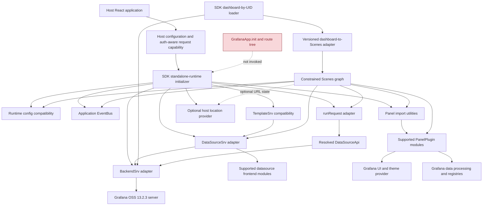

# Grafana Runtime Investigation

Related documents:

- `docs/project/project-context.md`
- `docs/architecture/architecture-overview.md`
- `docs/architecture/research/phase0-research-plan.md`
- `docs/architecture/research/grafana-source-map.md`
- `docs/architecture/research/grafana-scenes-investigation.md`
- `docs/architecture/research/grafana-data-investigation.md`
- `docs/architecture/research/grafana-ui-investigation.md`
- `docs/architecture/decisions/`

## Document metadata

| Field | Value |
| --- | --- |
| Workstream | Phase 0, Workstream 5: `@grafana/runtime` investigation |
| Status | Completed static source and published-package investigation; POC validation remains required |
| Research date | 2026-10-03 |
| Grafana baseline | Grafana OSS `v13.2.3` at `6193dc03311b631b9727b560d24369e683dc396e` |
| Package baseline | `@grafana/runtime@13.2.3` |
| Companion packages | `@grafana/data@13.2.3`, `@grafana/ui@13.2.3`, `@grafana/schema@13.2.3`, `@grafana/scenes@8.13.5` |
| Overall conclusion | A bounded standalone runtime is technically plausible for a POC, but only through an SDK-owned, page-lifetime compatibility initializer built on internal-annotated singleton setters and project implementations of services that Grafana does not publish. It is not a supported turnkey Runtime mode. |

## Scope and evidence method

This investigation asks whether the runtime services needed for dashboard retrieval, datasource access, query execution, panel resolution, configuration, events, and location behavior can be initialized explicitly in an independent React host. It does not implement that initializer, install packages, or run a browser POC.

Evidence was collected from:

- the official `@grafana/runtime@13.2.3` npm registry metadata and published tarball;
- Grafana source at the pinned `v13.2.3` tag;
- `@grafana/scenes` source at the pinned `v8.13.5` tag;
- current dashboard, query, datasource, plugin-loading, and embedded-dashboard application source; and
- official Grafana plugin-development documentation.

The published artifact was inspected separately from the monorepo source. The source workspace exposes `@grafana/runtime/internal` only to Grafana source builds, while the npm package removes that subpath from its export map.

Findings use these labels:

- **Verified fact**: directly supported by pinned source, declarations, tests, package metadata, or official documentation.
- **Inference**: a consequence of verified facts that has not been demonstrated in an independent React host.
- **Open question**: requires the dashboard API, panel dependency, or controlled POC workstream.

## Executive finding

`@grafana/runtime@13.2.3` is a service-locator package for code already running inside Grafana, not a standalone runtime container. Its own README labels the package beta, says that it requires Grafana to be running, and expects the package functions to be supplied as shared externals.

The package nevertheless publishes the interfaces and module-level injection slots that Scenes consumes:

- `BackendSrv` with `getBackendSrv` and `setBackendSrv`;
- `DataSourceSrv` with `getDataSourceSrv` and `setDataSourceSrv`;
- `getRunRequest` and `setRunRequest`;
- `getPluginImportUtils` and `setPluginImportUtils`;
- `getAppEvents` and `setAppEvents`;
- `TemplateSrv` with `getTemplateSrv` and `setTemplateSrv`;
- a default `locationService` plus a React `LocationServiceProvider`; and
- a public `config` singleton constructed at module evaluation.

These are not a supported external bootstrap API. Most setters are explicitly marked `@internal`; several are one-shot and have no production reset; `config` is initialized from `window.grafanaBootData` before an SDK initializer could run through ordinary static imports; and Runtime does not publish Grafana's concrete backend service, datasource service, query executor, datasource plugin importer, built-in panel importer, or embedded dashboard implementation.

The evidence therefore supports a narrow conclusion:

1. The SDK does not need `GrafanaApp.init`, the Grafana route tree, or Grafana navigation to satisfy the service calls made by a constrained Scenes graph.
2. A POC can install compatible project-owned services into the published root setters and can omit shell-only services.
3. That initializer must be process-wide and idempotent, not per dashboard mount.
4. It cannot promise two independent Grafana base URLs or configurations in one JavaScript realm at this baseline.
5. Native built-in panels and general datasource plugins remain blockers until their unpublished loading paths receive an acceptable disposition.

## Exact package baseline

### Published artifact

**Verified fact.** The inspected consumer artifact is the published [`@grafana/runtime@13.2.3`](https://registry.npmjs.org/%40grafana%2Fruntime/13.2.3) package.

| Item | Exact value |
| --- | --- |
| Package | `@grafana/runtime@13.2.3` |
| npm integrity | `sha512-TS8Qdzkg3uOUefgpfl+6kIK6LeOE60PLLBMvDayCMXmqhoqM/c4ufNVyPOTkAfFiM8BA2AFgG8d+qelJQnYtuQ==` |
| npm tarball SHA-1 | `a24d551fd76eac681da1c9f274272d5511ed6fab` |
| Published file count | 486 |
| License | Apache-2.0 |
| ESM entry | `./dist/esm/index.mjs` |
| CommonJS entry | `./dist/cjs/index.cjs` |
| Declaration entry | `./dist/types/index.d.ts` |
| Tree-shaking declaration | `"sideEffects": false` |
| React peers | `react >=19`, `react-dom >=19` |
| Published `gitHead` | `8ea0d7e31a25f84c2b5a1c173070d8cde8740924` |

The exact Grafana package dependencies are `@grafana/data`, `@grafana/e2e-selectors`, `@grafana/schema`, and `@grafana/ui`, all at `13.2.3`. Relevant runtime dependencies include RxJS, History 4, OpenFeature packages, `@grafana/faro-web-sdk`, `lru-cache`, and `react-use`.

**Verified fact.** Grafana OSS `v13.2.3` resolves to `6193dc03311b631b9727b560d24369e683dc396e`. As in the Data and UI workstreams, the npm tarball's `gitHead` is the direct parent used by the release pipeline before the release commit. The tag, package version, artifact integrity, and package contents are the baseline together.

### Documented operating model

**Verified fact.** The pinned package README states that Runtime is beta, requires Grafana to be running already, and expects its functions to be imported as externals. Official Grafana plugin documentation explains that Grafana normally uses SystemJS to load plugins and share the application's Grafana packages and singleton dependencies with them.

**Inference.** An independent host that bundles Runtime does not inherit Grafana's service initialization, SystemJS import map, package sharing, or version alignment. Standalone use is outside the documented package model even when a needed symbol appears in the root export.

## Published package boundary

### Export map

**Verified fact.** The published manifest exposes only:

| Subpath | Contents | SDK rule |
| --- | --- | --- |
| `@grafana/runtime` | Root ESM/CJS implementation and declarations | Selected exact-version symbols only, behind the compatibility layer |
| `@grafana/runtime/unstable` | Explicitly unstable logging, analytics, plugin settings, and new datasource APIs | POC-only if unavoidable; reject for the initial production path |
| `@grafana/runtime/package.json` | Package metadata | Diagnostics or build-time use only |

The source manifest additionally defines `./internal` with only the `@grafana-app/source` condition. The package preparation step removes that export. The tarball contains some generated `dist/types/internal` declarations, but it contains no published internal JavaScript entry and the export map blocks consumers from resolving the subpath.

### Root surface relevant to rendering

| Group | Representative root exports | Role in the candidate path |
| --- | --- | --- |
| Backend transport | `BackendSrv`, `BackendSrvRequest`, `FetchResponse`, `FetchError`, `getBackendSrv`, `setBackendSrv` | Dashboard/API transport and datasource proxy requests |
| Datasources | `DataSourceSrv`, `RuntimeDataSource`, `DataSourceWithBackend`, `getDataSourceSrv`, `setDataSourceSrv` | Resolve datasource settings and instances; execute resource/query calls |
| Queries | `getRunRequest`, `setRunRequest`, `createQueryRunner`, `setQueryRunnerFactory`, response/error helpers | Convert datasource response streams into `PanelData` |
| Plugins | `getPluginImportUtils`, `setPluginImportUtils`, panel-installed/version/ID helpers | Resolve `PanelPlugin` modules for Scenes |
| Configuration | `config`, `GrafanaBootConfig` | Theme, boot user, build, namespace, features, refresh, datasource defaults, and URL settings |
| Events | `RefreshEvent`, `ThemeChangedEvent`, `TimeRangeUpdatedEvent`, `getAppEvents`, `setAppEvents` | Cross-panel application event compatibility |
| Variables | `TemplateSrv`, `getTemplateSrv`, `setTemplateSrv` | Datasource-variable and legacy interpolation compatibility |
| Location | `LocationService`, `locationService`, `LocationServiceProvider`, `useLocationService`, `HistoryWrapper`, `setLocationService` | URL state and navigation compatibility |
| Embedded component | `EmbeddedDashboard`, `EmbeddedDashboardProps`, `setEmbeddedDashboard` | Alpha indirection slot populated by Grafana application code |
| Optional services | live, echo, correlations, screenshots, plugin-extension hooks, pickers, analytics, user, and navigation helpers | Mostly outside the initial read-only rendering path |

### Internal and unstable surfaces

The unpublished [`src/internal/index.ts`](https://github.com/grafana/grafana/blob/v13.2.3/packages/grafana-runtime/src/internal/index.ts) exposes the application bootstrap seams that are unavailable to npm consumers, including:

- full panel, app, and datasource plugin metadata access and seeding;
- datasource instance-settings initialization and datasource plugin importer injection;
- full `PanelDataErrorView`, `PanelRenderer`, `PluginPage`, and datasource picker injection;
- OpenFeature initialization and Grafana core flag access; and
- several cache, user-storage, journey, and plugin-extension facilities.

The published unstable entry says its APIs must not be used externally or by community plugins. It includes the new datasource settings/instance APIs, but the production initialization functions for those caches and importers remain internal.

**Inference.** The new datasource API does not solve standalone initialization: its readable operations are unstable, while the functions needed to seed settings and install the concrete plugin importer are unpublished.

## API stability classification

This classification uses source annotations, export-path intent, and package documentation. The entire package remains beta.

| API or group | Classification | Standalone treatment |
| --- | --- | --- |
| `BackendSrv`, request/response/error contracts, `getBackendSrv` | Public/stable at the pinned version | Adopt contracts behind an adapter |
| `setBackendSrv` | Internal, despite root export | POC/compatibility initializer only |
| `DataSourceSrv`, filters, `getDataSourceSrv` | Public/stable at the pinned version | Adopt contracts behind an adapter |
| `setDataSourceSrv` | Internal, despite root export | POC/compatibility initializer only |
| `DataSourceWithBackend` | Public/stable at the pinned version | Candidate helper for supported datasource modules; not a general resolver |
| `RuntimeDataSource` | Published but unresolved | Defer unless a project-owned runtime datasource is required |
| `getRunRequest`, `setRunRequest`, `createQueryRunner`, `setQueryRunnerFactory` | Internal or unresolved; the factory and setter declarations are explicitly internal | Use only through a pinned compatibility boundary; omit factory if Scenes does not need it |
| `getPluginImportUtils`, `setPluginImportUtils` | Publicly resolvable but unstable/unresolved | Required adapter seam; private structural parameter type and one-shot lifecycle |
| `config` | Public singleton | Required but not explicitly initializable; POC-only boot/config emulation |
| `GrafanaBootConfig` | Root exported, unresolved | Do not expose or treat construction as a supported SDK bootstrap contract |
| `RefreshEvent`, `ThemeChangedEvent`, `TimeRangeUpdatedEvent` | Public/stable at the pinned version | Adopt internally where native panels require them |
| `getAppEvents` | Public/stable at the pinned version | Adopt behind event adapter |
| `setAppEvents` | Internal, despite root export | Compatibility initializer only |
| `TemplateSrv`, `getTemplateSrv` | Public/stable at the pinned version | Adapt for variables and legacy datasource behavior |
| `setTemplateSrv` | Internal, despite root export | Compatibility initializer only |
| `LocationService`, `locationService`, `locationSearchToObject` | Public/stable at the pinned version | Limit to reads or host-controlled state; do not expose publicly |
| `HistoryWrapper`, `setLocationService` | Internal; setter is test-only in production builds | Reject as a production injection path |
| `LocationServiceProvider`, `useLocationService` | Root exported but stability unresolved | Candidate for optional host URL integration; insufficient for direct singleton readers |
| `EmbeddedDashboard` | Public/alpha | Reject as a standalone entry point at this baseline |
| `setEmbeddedDashboard` | Internal | Omit unless testing the indirection itself |
| `PanelDataErrorView` | Root exported with an internal implementation contract | Accept minimal fallback or provide an SDK-owned error view outside the unpublished setter |
| Live service contracts | Public/alpha | Defer streaming support |
| `@grafana/runtime/unstable` | Public/unstable | Reject for production; narrowly investigate only when the POC cannot use stable interfaces |
| `@grafana/runtime/internal` or deep `dist` imports | Internal/unpublished | Reject |

## Backend transport

### Contract and concrete implementation

**Verified fact.** [`BackendSrv`](https://github.com/grafana/grafana/blob/v13.2.3/packages/grafana-runtime/src/services/backendSrv.ts) is a public interface. It provides Promise helpers for GET, DELETE, POST, PATCH, and PUT, plus Observable `fetch` and `chunked` operations. `BackendSrvRequest` includes headers, params, response type, request ID, `AbortSignal`, Fetch credentials, and error/success alert flags.

`getBackendSrv` is public. `setBackendSrv` is root exported but explicitly marked internal. Both address one module-level variable. The setter has no duplicate-initialization guard and no cleanup contract.

**Verified fact.** Runtime publishes no concrete `BackendSrv` class. Grafana's implementation lives in unpublished [`public/app/core/services/backend_srv.ts`](https://github.com/grafana/grafana/blob/v13.2.3/public/app/core/services/backend_srv.ts) and depends on application events, the authenticated context service, session rotation, URL-token login, request queues, query-inspector events, modal UI, and application configuration.

**Inference.** Importing or copying the concrete Grafana service would pull shell and authentication behavior that the SDK must not own. The correct candidate is a project-owned structural implementation of the public interface around a host-supplied request capability.

### Request lifecycle and cancellation

The Grafana application implementation demonstrates two cancellation conventions:

1. `fetch` is an RxJS Observable; unsubscription tears down its subscriptions and the underlying `fromFetch` chain.
2. A new request with the same `requestId`, or an explicit app-level cancellation notification, completes the previous request and surfaces a cancelled query error.

The app-owned `runRequest` additionally registers a `finalize` handler that calls the concrete app backend's non-interface `resolveCancelerIfExists(requestId)`. This cancellation helper is not part of public `BackendSrv`.

**Inference.** The SDK query adapter cannot simply reuse Grafana's app `runRequest`. It must make unsubscription cancel the underlying host request, preferably through `AbortController`, and must define whether duplicate request IDs supersede earlier work. Scenes already unsubscribes its previous query on refresh, range changes, cancellation, and deactivation; the injected request path must preserve that cancellation rather than only ignoring late results.

For dashboard-by-UID loading, current Grafana API clients call Promise-based `get` without an abort signal. The SDK loader must add its own abort and stale-generation protection when a UID changes; Runtime does not supply that lifecycle automatically.

### URL and authentication assumptions

**Verified fact.** `BackendSrvRequest` contains no Grafana base-URL property. Grafana's concrete implementation passes the supplied URL to Fetch after parameter serialization. Its default credential mode is `same-origin`; `credentials` can override it, while `withCredentials` is deprecated.

The concrete app service also applies signed-in-user behavior, organization headers, token rotation, alert emission, and special handling for local URLs. None of that is defined by the public interface.

**Inference.** The standalone adapter must own deterministic base-URL resolution, including any Grafana subpath, and the host must supply authorization-aware request behavior. Cookie credentials, CORS, SameSite policy, CSRF behavior, bearer-token exposure, and organization selection are deployment constraints, not defaults the SDK can infer safely.

The adapter should never log credentials, persist secrets, or silently fall back to anonymous access. These conclusions reinforce ADR-002 rather than introducing an SDK backend.

## Datasource runtime

### Public service contract

**Verified fact.** [`DataSourceSrv`](https://github.com/grafana/grafana/blob/v13.2.3/packages/grafana-runtime/src/services/dataSourceSrv.ts) is a public interface with:

- `get` for resolving a `DataSourceApi` by UID, name, reference, or default;
- `getList` and `getInstanceSettings`;
- `reload`; and
- `registerRuntimeDataSource`.

`getDataSourceSrv` is public. `setDataSourceSrv` is root exported but internal. The singleton can be replaced repeatedly and has no disposal hook.

### Initialization and plugin instances

**Verified fact.** Grafana's concrete [`DatasourceSrv`](https://github.com/grafana/grafana/blob/v13.2.3/public/app/features/plugins/datasource_srv.ts) is application-owned. `GrafanaApp.init` initializes it with `config.datasources` and `config.defaultDatasource`, injects it into Runtime, and wires:

- datasource metadata caches;
- a datasource plugin importer;
- expression datasource instances;
- template interpolation;
- plugin instance caching; and
- `/api/frontend/settings` reload behavior.

Runtime 13.2.3 contains a newer cache and loader under `services/dataSource`, but its public access is under `/unstable`. The functions that initialize instance settings and install the datasource module importer are available only from `@grafana/runtime/internal`. Production reset functions are absent; test resets are guarded by `NODE_ENV === 'test'`.

**Inference.** A standalone SDK must implement the stable `DataSourceSrv` interface itself or accept unstable plus unpublished initialization, which this project rejects. The adapter can resolve a deliberately supported set of datasource instances, but general Grafana datasource compatibility requires access to each datasource's frontend module and its interpolation/query-variable behavior.

### Query and resource requests

**Verified fact.** The public [`DataSourceWithBackend`](https://github.com/grafana/grafana/blob/v13.2.3/packages/grafana-runtime/src/utils/DataSourceWithBackend.ts) base class builds normal query requests to `/api/ds/query`, attaches datasource/plugin/dashboard/panel headers, normalizes backend responses, exposes datasource resource GET/POST helpers, and optionally switches to newer API-server paths based on feature flags.

It uses `getBackendSrv`, Runtime config, datasource instance settings, optional Grafana Live, and internal OpenFeature access. Its base `applyTemplateVariables` method is a no-op; concrete datasource plugins override behavior as needed.

**Inference.** `DataSourceWithBackend` is useful only after a compatible datasource frontend class has been obtained. It is not a substitute for Prometheus, Loki, SQL, expression, mixed, dashboard, or third-party datasource modules. A generic POC datasource may prove transport and query mechanics, but it cannot establish compatibility with existing dashboards that rely on plugin-specific interpolation, variables, resource calls, or streaming.

## Query execution

### Runtime seams

Runtime exposes two separate query mechanisms:

- a `QueryRunnerFactory` used by `createQueryRunner`; and
- a `RunRequestFn` retrieved by `getRunRequest` and used directly by Scenes.

**Verified fact.** `setQueryRunnerFactory` is one-shot with no test bypass or reset. `setRunRequest` is one-shot outside tests and has no production reset. Calling either getter before initialization throws an error saying Grafana must have started.

**Verified fact.** `SceneQueryRunner` does not call `createQueryRunner`. It resolves a datasource, prepares `DataQueryRequest` values, and calls `getRunRequest()(datasource, request)`. Therefore the query-runner factory is not required for the constrained Scenes POC unless another selected panel or compatibility feature calls it.

### Grafana application behavior to preserve deliberately

Grafana's unpublished [`runRequest`](https://github.com/grafana/grafana/blob/v13.2.3/public/app/features/query/state/runRequest.ts) does more than invoke `datasource.query`:

- handles datasource query migrations;
- applies default query values and datasource filtering;
- redirects expression queries;
- merges multi-packet responses into one `PanelData` value;
- splits annotations from ordinary series;
- filters hidden-query results;
- converts failures to `DataQueryError`;
- emits a delayed loading state;
- records analytics; and
- cancels request-ID-associated network work on unsubscription.

**Inference.** A minimal adapter can reproduce only the subset required by the controlled POC, but omissions must be observable and documented. Replacing it with a direct `datasource.query(request)` call would not be equivalent for expression queries, streaming, migrations, hidden queries, multi-packet responses, or cancellation.

### Refresh and teardown

**Verified fact.** `SceneQueryRunner` unsubscribes the previous request before starting another, on explicit cancellation, and on deactivation. It reruns when its scene time range changes, when variables or extra query providers require it, or when `runQueries` is called. `SceneTimeRange.onRefresh` updates relative/absolute range state and publishes `RefreshEvent` for plugin compatibility.

**Inference.** Runtime does not own the refresh timer; Scenes does. Runtime owns the observable cancellation semantics. The POC must verify that time change, manual refresh, UID replacement, and unmount each abort network work and prevent stale `PanelData` from entering an inactive scene.

## Panel and plugin loading

### Runtime import utility

**Verified fact.** [`setPluginImportUtils`](https://github.com/grafana/grafana/blob/v13.2.3/packages/grafana-runtime/src/utils/plugin.ts) installs a structural object with `importPanelPlugin(id)` and `getPanelPluginFromCache(id)`. Scenes calls the getter before checking its own runtime panel map, so this singleton is required even for panels registered through Scenes.

The setter is publicly resolvable from the root, but its parameter interface is not exported, it has no stability annotation, it throws on a second initialization, and it has no reset or teardown.

### Metadata and module loading

Runtime's root exposes only high-level panel metadata helpers: installed status, version, and listed IDs. Full `PanelPluginMeta` access and cache initialization are internal. The internal implementation starts from deprecated `config.panels` unless a feature flag selects a newer plugin metadata API.

Grafana's concrete panel path is application-owned:

1. `importPanelPlugin` resolves full metadata through `@grafana/runtime/internal`.
2. `pluginImporter.importPanel` attaches metadata and caches the loaded `PanelPlugin`.
3. `importPluginModule` chooses the application built-in import map or external SystemJS loading.
4. `built_in_plugins.ts` maps Time series, Stat, Table, Text, and other core IDs to webpack dynamic imports under `public/app/plugins/panel`.
5. external plugins depend on Grafana's SystemJS loader, import map, optional integrity map, translations, and sandbox infrastructure.

**Verified fact.** Neither the built-in panel import map nor the panel implementations are published by Runtime. Runtime declares SystemJS types, but it does not provide Grafana's application SystemJS environment to an independent host.

**Inference.** The SDK can inject a resolver for a controlled panel catalog without the Grafana route tree, but Runtime does not tell it where to obtain current built-in modules. Native panel distribution remains a blocker for the production SDK and a mandatory POC branch. General third-party panel support is out of initial scope unless the project deliberately reproduces a secure, version-aligned plugin loading environment.

## Runtime configuration

### Import-time initialization

**Verified fact.** [`config`](https://github.com/grafana/grafana/blob/v13.2.3/packages/grafana-runtime/src/config.ts) is constructed once, during module evaluation, from `window.grafanaBootData.settings`, with the full boot payload retained as `config.bootData`. If the global is absent, Runtime logs an error outside tests and creates a sparse fallback containing empty settings, user, assets, and navigation.

The constructor also:

- merges settings into a mutable `GrafanaBootConfig` object;
- applies date-format settings to Data's global date formats;
- reads URL and local-storage feature-toggle overrides;
- derives `theme2` from the boot user's theme; and
- mutates boot-user light-theme state.

The root ESM entry evaluates `config.mjs`, so importing Runtime is not server-safe when `window` is absent. There is no public `setConfig`, reset, or reinitialize function.

### Values needed by the constrained path

Pinned Scenes source reads Runtime configuration including:

- `config.buildInfo.version`;
- `config.theme2` and feature toggles;
- `config.minRefreshInterval`;
- `config.bootData.user.timezone` and `weekStart`;
- `config.appSubUrl` and namespace for selected macros or APIs;
- public-dashboard settings; and
- feature-specific limits or link settings.

Representative application panels additionally read feature toggles and sanitization policy. Workstream 4 established that `config.theme2` must agree with the React `ThemeContext` value.

**Inference.** The sparse fallback is not a defined standalone configuration contract. A POC can mutate the exported object after import or arrange a minimal boot global before a dynamic import, but both are compatibility emulation rather than supported initialization. Static package imports may evaluate consumers before post-import mutation, so ordering must be observed rather than assumed.

### Host-owned configuration inputs

The eventual adapter must derive a minimum, versioned configuration from explicit host inputs and controlled server responses. At least these policies must be named:

- Grafana base URL and application subpath;
- namespace/organization context;
- build/server version evidence;
- datasource settings and default datasource;
- active theme, locale, timezone, and week start;
- selected feature toggles required by loaded modules;
- sanitization policy; and
- refresh limits.

The public SDK should not accept or expose an arbitrary `GrafanaBootConfig`. That would leak a large application-owned contract and make unsupported flags appear supported.

## Events

**Verified fact.** Grafana's application event bus is simply an `EventBusSrv` from `@grafana/data`, installed with `setAppEvents`. `EventBusSrv` is public but alpha. It supports typed events, legacy emit/on/off behavior, scoped buses, and `removeAllListeners`.

Each Scenes object also owns an instance-local event bus. `VizPanelRenderer` and `VizPanel` nevertheless fall back to Runtime's global application bus for panel attention and panel `eventBus` props when a scene cursor-sync bus is absent.

**Inference.** A standalone event implementation is feasible: the SDK can create one compatible `EventBusSrv` and install it once. It should be treated as a page-runtime service, not destroyed when one dashboard unmounts. Calling `removeAllListeners` for a single instance would break sibling dashboards.

Event isolation is incomplete. Same-runtime dashboards may receive each other's global panel events unless the scene supplies a scoped/local bus at every relevant call site. The POC must observe refresh, cursor, attention, and legacy panel events with two roots.

## Location and navigation

### Default singleton and provider

**Verified fact.** Runtime constructs `locationService` at module evaluation using `HistoryWrapper`, which creates browser history outside tests and uses `config.appSubUrl` as its basename. The public singleton can push, replace, reload, read query state, and expose an observable.

`LocationServiceProvider` and `useLocationService` provide a per-subtree service to hook consumers. However, `SceneTimeRange.getUrlState`, URL macros, and some Scenes compatibility code import the module-level `locationService` directly. `setLocationService` exists only for tests and throws in production.

### Standalone disposition

The initial SDK does not need Grafana navigation. It can:

- exclude `SceneApp`, `PluginPage`, Grafana route construction, and URL synchronization;
- keep dashboard state in the scene and host props/callbacks;
- treat data links through an explicit host policy; and
- avoid calling Runtime navigation methods.

**Inference.** A host `LocationServiceProvider` is useful but cannot fully replace the global singleton for all Scenes code. The POC should use no URL-sync manager and verify that rendering and time/variable control do not mutate host history. URL macros may still read host query state and should be classified separately.

Supporting host-router synchronization later requires a bounded adapter and collision policy for multiple dashboards. It does not justify bootstrapping Grafana's router.

## `EmbeddedDashboard` runtime shim

**Verified fact.** Runtime exports an alpha mutable `EmbeddedDashboard` component whose default implementation throws `EmbeddedDashboard requires runtime initialization`. Its internal setter replaces the module-level component without a guard or reset.

`GrafanaApp.init` injects `EmbeddedDashboardLazy`, which dynamically imports application-owned [`public/app/features/dashboard-scene/embedding/EmbeddedDashboard.tsx`](https://github.com/grafana/grafana/blob/v13.2.3/public/app/features/dashboard-scene/embedding/EmbeddedDashboard.tsx). That implementation:

- uses the application dashboard state manager and `DashboardRoutes.Embedded`;
- loads by UID;
- depends on app-owned V1/V2 conversion and `DashboardScene` behavior;
- activates/deactivates the scene;
- renders controls and the scene body; and
- supports initial URL state, controlled time range, refresh token, and state-change callbacks.

**Verified fact.** The implementation is not included in the npm package. The runtime setter is only an indirection hook; it does not lazily discover or download the Grafana implementation.

**Inference.** The hook is technically reusable only to inject a component the SDK already owns. That does not solve dashboard loading, conversion, providers, or panel modules. The SDK should render its project-owned Scenes boundary directly and reject the alpha shim as the primary architecture unless the POC finds a concrete advantage.

## Global singleton behavior

### Setter and reset inventory

| State | Set behavior | Production reset/teardown | Test behavior | Multi-instance implication |
| --- | --- | --- | --- | --- |
| `config` | Constructed once at module evaluation | None; object fields are mutable but initialization is not repeatable | Module reset required for true isolation | One boot/config identity per resolved Runtime module |
| Backend service | Reassignable setter | None | Tests replace directly | Replacement changes all dashboards immediately |
| Datasource service | Reassignable setter | None | Tests replace or assign `undefined` by cast | One resolver/cache policy for all dashboards |
| Template service | Reassignable setter | None | Tests replace directly | Legacy interpolation is global |
| Application event bus | Reassignable setter | None | Tests replace directly | Global cross-instance event channel |
| Query runner factory | Throws after first set | None | No test exception | Page-lifetime one-shot |
| Run-request function | Throws after first set outside tests | None | Tests may replace | Page-lifetime one-shot in production |
| Panel import utilities | Throws after first set | None | No test exception | One panel catalog/cache policy per page |
| Current user | Throws after first non-null set | None | No public reset | One user/security context per page |
| Default location service | Created at import; setter rejects outside tests | None | Test-only replacement | Direct consumers share host browser history |
| Legacy location service | Reassignable setter | None | Replaceable | Deprecated; exclude |
| Live service | Reassignable setter | None | Replaceable | One stream connection policy if enabled |
| Embedded dashboard component | Reassignable setter | None | Replaceable | Last replacement is global |
| Panel/datasource metadata and module caches | Internal initialization; long-lived maps/promises | No public reset | Internal test setters/resets | IDs and modules shared process-wide |
| New datasource settings/instance caches | Internal initialization plus unstable reads | No public reset/unregister | Internal guarded resets | Cannot hold independent catalogs cleanly |

### Test isolation

**Verified fact.** Upstream tests often replace reassignable service singletons directly. More complex datasource caches provide `_resetForTests`, but those functions are internal, deep, and guarded. The one-shot query factory and plugin import utility do not expose even a test reset through the root.

**Inference.** SDK tests cannot rely on reinitializing Runtime within one module graph. They will need isolated browser pages, workers/realms, or module-reset test environments for configuration variants. A production SDK should initialize once and validate later calls against the original identity rather than attempt teardown.

### Multiple SDK instances and base URLs

Two scene roots may share one Runtime configuration when they use the same:

- Grafana server/base path and authorization context;
- organization/namespace and user settings;
- datasource and panel catalog;
- theme-global assumptions;
- event, location, and feature-toggle policy; and
- exact physical package instances.

Two independent Grafana servers are not supported by these service slots. A multiplexer would need an instance key at every call. Backend requests sometimes contain dashboard or panel identifiers, but plugin import calls contain only plugin ID, config reads carry no instance key, and the datasource/event/location getters are global.

**Inference.** Transparent per-instance multiplexing is incomplete and unsafe. The initial SDK should reject a second incompatible runtime configuration in the same JavaScript realm. Separate iframes are prohibited, but separate page realms or independently loaded applications remain deployment-level isolation options, not SDK multi-instance support.

## Package behavior versus Grafana application initialization

| Capability | Importing published Runtime provides | `GrafanaApp.init` or application source adds |
| --- | --- | --- |
| Service interfaces/getters | Yes | Concrete instances |
| Config object | Yes, from boot global or sparse fallback | Server-supplied complete boot data and later config updates |
| Backend requests | Interface only | Concrete queued Fetch service, auth/session/org/error behavior |
| Datasource lookup | Interface and helpers | Settings, expression datasource, importer, concrete `DatasourceSrv` |
| Query execution | Empty slots and response helpers | Concrete `QueryRunner` and `runRequest` |
| Panel imports | Empty one-shot slot | Full metadata, built-in import map, SystemJS importer, caches |
| Application events | Empty slot and event classes | Concrete shared `EventBusSrv` |
| Location | Default browser-history singleton | Legacy location binding, org-ID behavior, click interception, router integration |
| Embedded dashboard | Throwing alpha placeholder | Lazy application implementation and all app-owned loader/converter state |
| Panel errors/rendering | Minimal placeholders | Full app implementations through internal setters |
| Data registries | Not owned by Runtime | Standard field/options/transformer initialization |
| i18n/theme/UI providers | Not initialized by Runtime | Application initialization and provider tree |
| Navigation/chrome/extensions/analytics | Interfaces or hooks may exist | Full application services and route tree |

## Verified facts

1. Runtime 13.2.3 is beta and its README assumes Grafana is already running.
2. The package publishes root, unstable, and package metadata exports; the source-only internal subpath is removed from the npm export map.
3. Runtime is a service locator: it publishes interfaces/getters and many setters, but it does not publish the concrete services used by Grafana core.
4. `config` is created from `window.grafanaBootData` at module evaluation and has no public initializer or reset.
5. Backend, datasource, template, event, location, query, plugin, user, and embedded-component state are module-level singletons.
6. Query-runner factory, run-request, plugin-import, and current-user initialization is one-shot in production, with no public teardown.
7. Scenes requires Runtime config, datasource lookup, run-request execution, panel import utilities, application events, and selected template/location behavior.
8. Scenes uses `getRunRequest` directly; its basic query path does not require `createQueryRunner`.
9. Grafana's concrete `runRequest`, backend service, `DatasourceSrv`, datasource importer, panel importer, built-in panel map, and embedded dashboard live in unpublished application source.
10. Grafana's normal third-party plugin environment relies on SystemJS and shared singleton packages supplied by the application.
11. The public alpha `EmbeddedDashboard` throws until application code injects an implementation; the implementation itself is unpublished.
12. A React location provider cannot replace every direct read of Runtime's global `locationService`.
13. Runtime exposes enough structural seams to install a constrained service set without calling `GrafanaApp.init`, but the installation APIs are not a supported standalone bootstrap contract.

## Inferences

1. A single page-lifetime compatibility runtime is feasible to test without the Grafana shell if the SDK implements the required service contracts and initializes them before creating scenes.
2. Production adoption would intentionally depend on exact-version internal-annotated root setters, so the compatibility layer and upgrade tests are mandatory.
3. A host-supplied transport plus SDK `BackendSrv` adapter is safer than importing Grafana's application backend implementation.
4. General datasource compatibility is blocked by frontend datasource module distribution and initialization, not by the `DataSourceSrv` interface itself.
5. General native panel compatibility is blocked by panel module distribution and metadata/loading infrastructure, not by the Runtime import slot itself.
6. Same-configuration dashboard instances may coexist, but independent Runtime configurations and multiple Grafana base URLs cannot be promised.
7. URL synchronization, Grafana navigation, live streaming, plugin extensions, analytics, screenshots, correlations, and editor services can be omitted from the first POC.
8. The alpha embedded shim is not useful as a shortcut because injecting an SDK-owned component merely adds another global indirection.
9. Unmount can dispose scene subscriptions and requests, but it cannot undo Runtime registration or restore a prior config safely.

## Open questions

1. Can a minimal boot/config object be established before all Runtime/Scenes imports in the selected bundler without requiring the host to manage `window.grafanaBootData`?
2. Which exact config fields are read during module evaluation versus scene activation and panel render?
3. Will Grafana consider a supported public service-container or initialization API, or must this project own internal-setter compatibility indefinitely?
4. Can the host request boundary preserve Observable unsubscription, `AbortSignal`, duplicate request-ID cancellation, error shape, headers, and streaming behavior across same-origin and cross-origin deployments?
5. Which browser authentication arrangements pass CORS, cookie, SameSite, CSRF, organization, and token-safety requirements for the controlled POC?
6. Which datasource frontend modules are required by the fixture dashboard, and can they be obtained from a supported distributable surface?
7. How much of app-owned `runRequest` must be reproduced for the fixture: migrations, expressions, packet merging, streaming, query analytics, and cancellation?
8. Can a constrained panel resolver load the representative built-in modules without `public/app` deep imports or Grafana's full SystemJS environment?
9. Can two same-runtime scene roots avoid event, template, location, datasource cache, plugin cache, and configuration cross-talk?
10. How should tests isolate one-shot Runtime state across cases and bundle formats without internal resets?
11. Does a late datasource/plugin promise mutate an obsolete scene after UID change even when query observables are cancelled?
12. Which native panels or datasources require `PanelDataErrorView`, live, current-user, OpenFeature, or other services currently classified optional?
13. Can external plugin code be loaded securely while guaranteeing one React and one aligned Grafana package family?
14. Should the initial support contract explicitly limit one Grafana connection per page, or can a later realm-based architecture support more?

## Final assessment

### 1. Runtime service dependency graph

The unresolved external nodes are `DSModules` and `PanelModules`. Runtime supplies neither catalog. They remain the principal dependency-closure risks for Workstream 7.

### 2. Service initialization and ownership table

| Runtime dependency | Required for minimum path | Initialization mechanism at 13.2.3 | Owner | Lifecycle | Standalone viability |
| --- | --- | --- | --- | --- | --- |
| Host request/auth policy | Yes | Not supplied by Runtime | **Host supplied** | Host/page lifetime | Required and feasible subject to browser deployment tests |
| `BackendSrv` | Yes | Internal root `setBackendSrv` | **SDK compatibility adapter** | Initialize once; adapter owns aborts | POC candidate |
| Dashboard-by-UID client | Yes | Not supplied by Runtime package | **SDK compatibility adapter** | Per load with abort/stale guard | POC candidate; API details belong to Workstream 6 |
| Runtime `config`/boot state | Yes | Import-time `window.grafanaBootData`; no setter | **POC-only emulation** | One per Runtime module/page | High risk; production decision deferred |
| Theme, locale, timezone, week-start inputs | Yes | Not supplied independently by Runtime | **Host supplied** | Host/page policy | Required inputs; supported values must be constrained |
| Theme/config propagation | Yes | Grafana app initializes Runtime/Data/UI channels | **SDK compatibility adapter** | Page/runtime policy plus React provider | POC candidate; all channels must remain coherent |
| Application event bus | Yes for normal `VizPanel` path | Internal root `setAppEvents` | **SDK compatibility adapter** | One shared bus per runtime | Feasible; multi-root isolation unverified |
| `TemplateSrv` | Variables/legacy datasource behavior | Internal root `setTemplateSrv` | **SDK compatibility adapter** | One shared service | POC candidate; avoid for features not in scope |
| `DataSourceSrv` | Yes for saved dashboard queries | Internal root `setDataSourceSrv` | **SDK compatibility adapter** | Shared settings and instance cache | Interface feasible; general plugin coverage blocked |
| Datasource settings/default | Yes | App boot/internal cache initializer | **SDK compatibility adapter** from host/server data | Runtime lifetime, reload explicitly | POC candidate for controlled fixtures |
| Datasource frontend importer/modules | Yes for arbitrary existing datasources | App-owned importer; internal injection for new API | **Blocker** | Shared module/instance cache | Must resolve per supported datasource |
| `runRequest` | Yes for Scenes queries | Internal one-shot `setRunRequest` | **SDK compatibility adapter** | One function per page; observable per request | POC candidate with cancellation tests |
| Query runner factory | No for constrained Scenes path | Internal one-shot setter | **Safely omitted** | Not initialized | Revisit only if selected module calls it |
| Panel import utilities | Yes for every `VizPanel` | One-shot root setter | **SDK compatibility adapter** | One resolver/cache per page | Interface feasible |
| Built-in panel modules/import map | Yes for native representative panels | Grafana app dynamic imports | **Blocker** | Shared module cache | Must resolve before production path closes |
| Third-party SystemJS loader | No for initial core-panel POC | Grafana application loader/import map | **Safely omitted** initially | None | Defer general third-party plugins |
| Fixed-catalog panel metadata | Yes for the representative POC panels | Not supplied through a public initializer | **POC-only emulation** | Shared fixed metadata map | Do not deep-import; validates only the chosen catalog |
| General panel metadata service | Needed for arbitrary plugins | `@grafana/runtime/internal` and boot/feature services | **Blocker** | Shared metadata cache | Must be resolved before general plugin support |
| Location provider | No for host-controlled initial state | Public provider; global singleton not replaceable in production | **SDK compatibility adapter** if URL sync is enabled | Host/router lifetime | Omit URL sync in initial POC |
| Grafana router/navigation | No | Application route tree | **Safely omitted** | None | Must remain excluded |
| `EmbeddedDashboard` shim | No | Internal setter injects unpublished app component | **Safely omitted** | Global mutable component | Reject as primary path |
| Full `PanelDataErrorView` | No for mounting; useful for fidelity | Internal setter, app-owned implementation | **POC-only emulation** or accept minimal fallback | Page lifetime | Test representative error states |
| Grafana Live | No for non-streaming fixtures | Internal setter/application connection | **Safely omitted** initially | Page/socket lifetime | Defer streaming panels |
| Current-user/RBAC service | No for controlled read-only render if host/server enforce access | Internal one-shot setter | **Safely omitted** initially | Page lifetime | Revisit if selected modules call it |
| OpenFeature remote provider | No if relevant feature behavior is pinned explicitly | Internal initialization | **Safely omitted** initially | Page lifetime | Avoid feature paths that require live flags |
| Echo, journey, analytics, correlations, screenshots, extensions, pickers, chrome | No | Grafana application bootstrap | **Safely omitted** | None | Outside initial rendering objective |
| Required standard Data registries | Yes for the POC capability set | Grafana application code | **SDK compatibility adapter** | One-shot mutable registries | Initialize only the verified subset from Workstream 3 |
| Unavailable application-owned Data registrations | Depends on selected transformations or panels | Grafana application code with no accepted package path | **Blocker** | One-shot mutable registries | Resolve per capability during the POC |
| UI theme/styles/assets/portals/i18n | Yes | Grafana application provider tree | **SDK compatibility adapter** | Page plus component lifecycle | Provider boundary carried from Workstream 4 |

### 3. Singleton and multi-instance risk assessment

| Scenario | Risk | Assessment for initial SDK |
| --- | --- | --- |
| Repeated mount/unmount against one initialized runtime | Medium | Plausible; scenes and requests can clean up, while Runtime stays alive intentionally |
| Two dashboards, same server/auth/theme/catalog | High until POC | Potentially supportable, but events, templates, location, Scenes globals, caches, and styles may cross-talk |
| Two dashboards with different themes | High | React theme context can differ; Runtime config/global styles cannot differ cleanly |
| Two Grafana organizations with one credential context | High | Global datasource/config/user state and headers make isolation ambiguous |
| Two Grafana base URLs or credentials | Critical | Reject initially; service calls lack a universal instance key for safe multiplexing |
| Hot reload/reinitialize | High | One-shot setters throw and caches have no production reset |
| Unit tests with multiple configurations in one module graph | High | Use module/realm isolation; do not depend on unavailable internal resets |
| Duplicate `@grafana/runtime` copies | Critical | Services installed in one copy are invisible to Scenes/plugins using another copy |
| Duplicate React or Grafana package family | Critical | Context, hooks, registries, and singleton identity split; enforce one aligned resolution |

The initial architecture should define a runtime identity from at least base URL, organization/namespace, authorization identity class, package versions, feature policy, and shared catalog. A second initializer with a different identity must fail clearly rather than replace global services silently.

### 4. Standalone-runtime feasibility conclusion

**Conclusion: conditionally feasible for the bounded POC; not yet approved as a production architecture.**

The SDK can provide an explicit standalone initialization layer without calling `GrafanaApp.init` or mounting the Grafana route tree. The minimum technical sequence is:

1. establish one exact-version React/Grafana package graph and browser-only load boundary;
2. establish the minimal Runtime config compatibility state before any scene or plugin reads it;
3. install one host-backed `BackendSrv` adapter;
4. install one event bus and the required template/datasource services;
5. install a cancellation-correct `runRequest` adapter;
6. install one constrained panel resolver;
7. initialize the Data registries, i18n, theme, UI providers, styles, assets, and portals identified by prior workstreams; and
8. create and activate a project-owned Scenes graph.

This sequence does not require Grafana routing or navigation. It does require unsupported/internal-annotated bootstrap seams and project-owned implementations of behavior Grafana keeps in application source. It must therefore be treated as an experiment behind one compatibility module, not as evidence that Runtime officially supports independent hosts.

The POC must stop or revise the architecture if any of these conditions occurs:

- a required service can only be initialized through `@grafana/runtime/internal` or a deep import;
- the actual built-in panels or datasource modules cannot be distributed and loaded acceptably;
- cancellation cannot reach the browser request;
- config must be changed per dashboard instance;
- basic rendering mutates host navigation; or
- two same-runtime roots cannot coexist without material cross-talk.

### 5. Adopt, adapt, defer, and reject classification

| Capability | Decision | Rationale |
| --- | --- | --- |
| Public Runtime service interfaces and request/error types | **Adopt behind compatibility adapter** | Useful exact-version contracts, but do not expose them through the SDK API |
| `getBackendSrv` consumer path | **Adopt behind compatibility adapter** | Native Grafana packages depend on it |
| SDK-owned host-backed `BackendSrv` | **Investigate in POC** | Necessary and feasible in principle; must prove URL, auth, error, stream, and cancellation semantics |
| Grafana application `BackendSrv` implementation | **Reject** | Unpublished and coupled to session, context, alerts, modal, inspector, and application services |
| `DataSourceSrv` contract | **Adopt behind compatibility adapter** | Required by Scenes and variables; implementation must remain project-owned/versioned |
| Runtime unstable datasource APIs | **Defer** | Useful migration direction, but explicitly forbidden for external use and not externally initializable |
| General datasource plugin loading | **Defer pending blocker resolution** | Required modules/importer are not published as a standalone catalog |
| `DataSourceWithBackend` for a controlled datasource | **Investigate in POC** | Preserves Grafana query/resource wire behavior but does not supply plugin-specific logic |
| `getRunRequest`/`setRunRequest` seam | **Adopt behind compatibility adapter** | Required by Scenes; internal, one-shot, and exact-version coupled |
| SDK-owned minimal `runRequest` | **Investigate in POC** | Must prove required Grafana semantics and cancellation |
| Query runner factory | **Defer** | Not needed by the constrained Scenes path |
| Panel import utility seam | **Adopt behind compatibility adapter** | Required by `VizPanel`, but one-shot and unstable/unresolved |
| Fixed representative panel catalog | **Investigate in POC** | Smallest way to validate the resolver while built-in distribution remains unresolved |
| Grafana app built-in importer and `built_in_plugins.ts` | **Reject as a direct dependency** | Unpublished application code and bundler-specific imports |
| Third-party SystemJS loading | **Defer** | Broad security, sharing, asset, and compatibility surface outside initial scope |
| Runtime `config` singleton | **Adopt behind compatibility adapter for POC only** | Unavoidable today, but import-time boot assumptions and absent initializer are high risk |
| Host-facing `GrafanaBootConfig` | **Reject** | Large application contract must not leak into the SDK API |
| `EventBusSrv` plus `setAppEvents` | **Adopt behind compatibility adapter** | Small feasible implementation; global isolation requires testing |
| Template service | **Adopt behind compatibility adapter** | Needed for selected variables and legacy datasource behavior |
| Runtime global `locationService` for navigation | **Reject** | Host owns routing and Grafana navigation is excluded |
| Optional `LocationServiceProvider` for bounded URL state | **Defer** | Provider does not cover all global readers; initial POC should omit URL sync |
| Runtime alpha `EmbeddedDashboard` as SDK entry point | **Reject** | Throwing placeholder; actual implementation is unpublished and shell-initialized |
| Grafana route tree, `PluginPage`, chrome, and navigation | **Reject** | Violates accepted project boundaries and is unnecessary for the candidate service graph |
| Live streaming, analytics, plugin extensions, screenshots, correlations, editors | **Defer** | Not required to prove the first native read-only rendering path |
| `@grafana/runtime/unstable`, `/internal`, and deep imports in production | **Reject** | Explicitly unsupported or unavailable from the published export map |
| Multiple incompatible Runtime configurations in one realm | **Reject initially** | Singleton and one-shot APIs provide no safe per-instance isolation |

## Workstream conclusion

Proceed to Workstreams 6 and 7 with a **bounded standalone-runtime POC hypothesis**, not with blanket adoption of Runtime as a standalone framework.

The POC hypothesis is that one page can initialize one Grafana-13.2.3 compatibility runtime, use a host-owned request capability, render a constrained Scenes graph, and clean up per-dashboard work without invoking `GrafanaApp.init` or Grafana navigation. The experiment must explicitly acknowledge its internal-setter and config-emulation dependencies.

No accepted ADR needs revision at this stage. Production feasibility still depends on closing the native panel and datasource module gaps, validating browser authorization and cancellation, and proving same-runtime multi-instance behavior.

## Upstream references

- [`@grafana/runtime@13.2.3` npm metadata](https://registry.npmjs.org/%40grafana%2Fruntime/13.2.3)
- [Runtime package manifest at `v13.2.3`](https://github.com/grafana/grafana/blob/v13.2.3/packages/grafana-runtime/package.json)
- [Runtime package README](https://github.com/grafana/grafana/blob/v13.2.3/packages/grafana-runtime/README.md)
- [Runtime public root exports](https://github.com/grafana/grafana/blob/v13.2.3/packages/grafana-runtime/src/index.ts)
- [Runtime unstable entry](https://github.com/grafana/grafana/blob/v13.2.3/packages/grafana-runtime/src/unstable.ts)
- [Runtime unpublished internal entry](https://github.com/grafana/grafana/blob/v13.2.3/packages/grafana-runtime/src/internal/index.ts)
- [Runtime configuration singleton](https://github.com/grafana/grafana/blob/v13.2.3/packages/grafana-runtime/src/config.ts)
- [`BackendSrv` contract](https://github.com/grafana/grafana/blob/v13.2.3/packages/grafana-runtime/src/services/backendSrv.ts)
- [Grafana application `BackendSrv`](https://github.com/grafana/grafana/blob/v13.2.3/public/app/core/services/backend_srv.ts)
- [Grafana Fetch request parsing](https://github.com/grafana/grafana/blob/v13.2.3/public/app/core/utils/fetch.ts)
- [`DataSourceSrv` contract](https://github.com/grafana/grafana/blob/v13.2.3/packages/grafana-runtime/src/services/dataSourceSrv.ts)
- [Runtime datasource settings cache](https://github.com/grafana/grafana/blob/v13.2.3/packages/grafana-runtime/src/services/dataSource/settings.ts)
- [Runtime datasource instance loader](https://github.com/grafana/grafana/blob/v13.2.3/packages/grafana-runtime/src/services/dataSource/dataSource.ts)
- [Grafana application `DatasourceSrv`](https://github.com/grafana/grafana/blob/v13.2.3/public/app/features/plugins/datasource_srv.ts)
- [`DataSourceWithBackend`](https://github.com/grafana/grafana/blob/v13.2.3/packages/grafana-runtime/src/utils/DataSourceWithBackend.ts)
- [Runtime query service slots](https://github.com/grafana/grafana/blob/v13.2.3/packages/grafana-runtime/src/services/QueryRunner.ts)
- [Grafana application `runRequest`](https://github.com/grafana/grafana/blob/v13.2.3/public/app/features/query/state/runRequest.ts)
- [Grafana query cancellation operator](https://github.com/grafana/grafana/blob/v13.2.3/public/app/features/query/state/processing/canceler.ts)
- [Scenes `SceneQueryRunner`](https://github.com/grafana/scenes/blob/v8.13.5/packages/scenes/src/querying/SceneQueryRunner.ts)
- [Runtime panel import utilities](https://github.com/grafana/grafana/blob/v13.2.3/packages/grafana-runtime/src/utils/plugin.ts)
- [Grafana panel plugin importer](https://github.com/grafana/grafana/blob/v13.2.3/public/app/features/plugins/importPanelPlugin.ts)
- [Grafana generic plugin importer](https://github.com/grafana/grafana/blob/v13.2.3/public/app/features/plugins/importer/pluginImporter.ts)
- [Grafana plugin module loader](https://github.com/grafana/grafana/blob/v13.2.3/public/app/features/plugins/importer/importPluginModule.ts)
- [Grafana built-in plugin import map](https://github.com/grafana/grafana/blob/v13.2.3/public/app/features/plugins/built_in_plugins.ts)
- [Runtime panel metadata service](https://github.com/grafana/grafana/blob/v13.2.3/packages/grafana-runtime/src/services/pluginMeta/panels.ts)
- [Runtime application events](https://github.com/grafana/grafana/blob/v13.2.3/packages/grafana-runtime/src/services/appEvents.ts)
- [Data `EventBusSrv`](https://github.com/grafana/grafana/blob/v13.2.3/packages/grafana-data/src/events/EventBus.ts)
- [Runtime template service](https://github.com/grafana/grafana/blob/v13.2.3/packages/grafana-runtime/src/services/templateSrv.ts)
- [Runtime location service](https://github.com/grafana/grafana/blob/v13.2.3/packages/grafana-runtime/src/services/LocationService.tsx)
- [Scenes time range and global location use](https://github.com/grafana/scenes/blob/v8.13.5/packages/scenes/src/core/SceneTimeRange.tsx)
- [Runtime alpha embedded dashboard shim](https://github.com/grafana/grafana/blob/v13.2.3/packages/grafana-runtime/src/components/EmbeddedDashboard.tsx)
- [Grafana embedded dashboard implementation](https://github.com/grafana/grafana/blob/v13.2.3/public/app/features/dashboard-scene/embedding/EmbeddedDashboard.tsx)
- [`GrafanaApp.init`](https://github.com/grafana/grafana/blob/v13.2.3/public/app/app.ts)
- [Official Grafana frontend npm dependency model](https://grafana.com/developers/plugin-tools/key-concepts/npm-dependencies)
- [Official Grafana app-plugin authentication guidance](https://grafana.com/developers/plugin-tools/how-to-guides/app-plugins/add-authentication-for-app-plugins)
