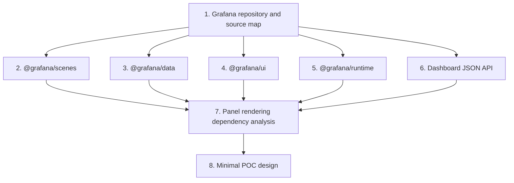

# Phase 0 Research Execution Plan

Related documents:

- docs/project/project-context.md
- docs/architecture/architecture-overview.md
- docs/architecture/decisions/

## Document Metadata

| Field | Value |
|---|---|
| Owner | Grafana React SDK maintainers |
| Status | Approved for execution planning |
| Created | 2026-09-30 |
| Last Updated | 2026-09-30 |

## Status

Approved for execution planning. This document defines research work; it does not record completed findings or authorize SDK implementation.

## Purpose

Determine whether an independent React application can render an existing Grafana OSS 13 dashboard, selected by UID, using Grafana-maintained frontend packages without starting the Grafana web application shell.

Phase 0 must replace the architecture's working assumptions with version-specific evidence and produce a minimal, bounded POC design. The POC itself requires a separate approval and implementation task.

## Fixed constraints

All research and recommendations must preserve the accepted project decisions:

- no iframe rendering, including fallback behavior;
- no Grafana web application shell, routing, or navigation;
- a frontend-only SDK with no project-owned backend;
- dashboard selection by UID;
- preference for Grafana-native rendering packages where technically viable; and
- isolation of Grafana-specific internals behind a compatibility boundary.

Research may conclude that a constraint makes the project infeasible. It must not silently weaken a constraint to obtain a positive result.

## Definition of standalone rendering

For Phase 0, standalone rendering means that a minimal React host application:

- owns its page shell, routing, layout, and React lifecycle;
- obtains a dashboard from an existing Grafana OSS 13 instance by UID;
- renders dashboard content into the host document rather than an iframe;
- initializes only explicitly identified Grafana providers, services, and adapters;
- does not bootstrap Grafana's application entry point, route tree, or navigation;
- does not require a backend shipped by this project; and
- disposes requests, subscriptions, timers, and rendering state when updated or unmounted.

Using an existing Grafana server for dashboard APIs, data-source proxy requests, or other supported runtime endpoints is compatible with this definition. Shipping a new SDK-specific service is not.

## Research principles

### Version pinning

Before investigation begins, record:

- the exact Grafana OSS 13 tag and commit SHA;
- the exact version and integrity metadata of every published package inspected;
- the Node.js and package-manager versions used for upstream inspection, if needed;
- the React version expected by each candidate package; and
- the browser and bundler versions used for any later experiment.

Do not generalize evidence from Grafana `main`, an older major release, or mismatched package versions to the selected OSS 13 baseline.

### Source hierarchy

Use evidence in this order:

1. source and tests at the pinned Grafana tag;
2. package manifests, exported type declarations, and published package contents for the matching version;
3. official Grafana documentation and maintained examples for that version; and
4. reproducible observations from a controlled experiment.

Community examples may help locate a path, but they cannot establish support or compatibility by themselves.

### Evidence record

Every material finding must include:

- classification as **verified fact**, **inference**, or **open question**;
- Grafana and package versions;
- repository path, symbol, test, documentation URL, or package export supporting it;
- reproduction steps when behavior was observed;
- shell, global, styling, licensing, or internal-API dependencies discovered; and
- the implication for adopt, adapt, defer, or reject decisions.

Negative findings require the same evidence quality as positive findings.

### Security and data handling

- Use only a controlled Grafana instance and sanitized dashboards.
- Never place service-account tokens, cookies, credentials, or private dashboard exports in the repository.
- Do not recommend long-lived privileged tokens in browser bundles.
- Record CORS, cookie, CSRF, origin, and authorization assumptions explicitly.
- Treat host-owned gateways as deployment context, not as components supplied by this project.

## Research outputs

All research artifacts become part of the project's architectural knowledge base and must be reviewed before changing accepted ADR decisions.

Phase 0 execution is expected to produce or update these research artifacts in `docs/architecture/research/`:

| Workstream | Output |
| --- | --- |
| Grafana repository/source | `grafana-source-map.md` |
| `@grafana/scenes` | Update `grafana-scenes-investigation.md` |
| `@grafana/data` | `grafana-data-investigation.md` |
| `@grafana/ui` | `grafana-ui-investigation.md` |
| `@grafana/runtime` | `grafana-runtime-investigation.md` |
| Dashboard JSON API | `dashboard-json-api-investigation.md` |
| Panel dependency analysis | `panel-rendering-dependencies.md` |
| Minimal POC design | Update `grafana-rendering-poc.md` |

These are outputs of future research tasks, not files created by this plan. Each artifact must use the evidence record above and end with a recommendation.

## Execution order

Workstreams 2 through 6 may run in parallel after the repository baseline is pinned. Workstream 7 reconciles their findings into one dependency model. Workstream 8 may start only when that model identifies a plausible standalone rendering path or clearly bounded alternatives to test.

## Workstream 1: Grafana repository and source investigation

### Objective

Build a version-pinned source map from Grafana's dashboard-by-UID request path to dashboard state construction, panel discovery, query execution, and React rendering. Separate reusable package code from application-shell code.

### Questions

- Which tag and commit represent the selected Grafana OSS 13 baseline?
- Where are the workspace manifests and matching frontend package sources?
- Which application entry points initialize dashboard rendering in Grafana itself?
- Which modules create dashboard models or scenes from saved dashboard data?
- Which services are supplied by Grafana boot code, dependency registries, globals, or route state?
- Which relevant symbols are exported through public package entry points?
- Which source licenses and package licenses apply to the candidate reuse path?

### Procedure

1. Pin the Grafana tag, commit SHA, and corresponding package versions.
2. Record the repository's frontend workspace and package topology from manifests rather than assumptions about directory names.
3. Trace dashboard loading from the UID route or API call through parsing, migration, state creation, and rendering.
4. Trace one built-in panel from plugin registration through component resolution and rendering.
5. Trace one panel query from scene or dashboard state through runtime services to the Grafana server.
6. Mark every dependency on boot data, global configuration, singleton services, routing, navigation, or application-level state.
7. Compare source imports with published package exports to identify internal-only boundaries.
8. Record relevant upstream tests that demonstrate supported initialization or lifecycle behavior.

### Evidence to capture

- A source-path and symbol map tied to the pinned commit.
- A package ownership map for each reusable symbol.
- A boot-dependency table classifying each dependency as host-supplied, configurable, adaptable, shell-only, or unresolved.
- A list of deep imports or unpublished modules that a candidate path would require.
- Applicable license files and package metadata.

### Deliverable and exit criteria

Produce `grafana-source-map.md`. This workstream is complete when another researcher can follow the recorded paths from UID retrieval to panel rendering and can identify where the Grafana shell enters the flow without searching the repository again.

Stop and escalate if no rendering path can be traced without importing an application entry point; that result materially changes the feasibility question for all later workstreams.

## Workstream 2: `@grafana/scenes` investigation

### Objective

Determine whether the Grafana OSS 13-compatible `@grafana/scenes` package can serve as the primary dashboard state and rendering runtime outside the Grafana shell.

### Questions

- Is the package documented and exported for use outside Grafana itself?
- Can a saved dashboard response be converted into a scene through public exports?
- Which providers, registries, runtime services, globals, CSS, and boot configuration are required?
- How are time range, refresh, variables, transformations, annotations, and panel repetition represented?
- How are panel plugins resolved and rendered?
- What lifecycle methods create, activate, deactivate, and dispose scene state?
- Can multiple independent scene roots coexist without shared-state collisions?
- Which required APIs are public, internal, experimental, or deprecated in the pinned version?

### Procedure

1. Inventory the package manifest, exports, peer dependencies, types, source, tests, and official examples for the pinned version.
2. Locate the dashboard-to-scene conversion path identified in Workstream 1.
3. Map direct imports and injected services needed by that path.
4. Trace state activation, subscriptions, URL synchronization, refresh timers, query runners, and teardown.
5. Identify assumptions about Grafana routes, location services, application events, plugin registries, themes, and configuration.
6. Compare the required surface with the standalone-rendering definition.
7. Classify each required non-public integration as replaceable adapter, POC risk, or blocker.

### Evidence to capture

- Public-export map with source and type references.
- Dashboard conversion and scene lifecycle sequence.
- Required provider/service matrix.
- Shared-global and multi-instance risk list.
- Feature coverage table for the POC behaviors.
- Versioning and support-status evidence.

### Deliverable and exit criteria

Update `grafana-scenes-investigation.md` with one recommendation:

- adopt Scenes as the primary runtime;
- adopt a constrained Scenes subset behind adapters; or
- reject Scenes and identify the next Grafana-native rendering path to evaluate.

The recommendation is complete only when every required shell service and internal import has an explicit disposition.

## Workstream 3: `@grafana/data` investigation

### Objective

Identify the data models, transformation contracts, display processing, and shared utilities required for dashboard and panel rendering, and determine whether they are safe public dependencies for the SDK boundary.

### Questions

- Which package exports are used by Scenes, runtime services, UI components, and representative panels?
- Which types cross the likely compatibility boundary, such as dashboard models, data frames, time ranges, field configuration, panel data, queries, and errors?
- Where do transformations, display processors, links, thresholds, units, and value mappings execute?
- Do relevant APIs depend on mutable global registries or Grafana boot configuration?
- Which types are stable public contracts versus implementation details?
- What version-coupling exists between `@grafana/data` and the other Grafana packages?

### Procedure

1. Inventory package exports, peer dependencies, source, and tests at the pinned version.
2. Starting from the representative panels, trace every direct and transitive use of `@grafana/data`.
3. Group required exports by data transport, transformation, display, dashboard schema, and plugin contracts.
4. Identify global registries, initialization calls, and mutable singleton state.
5. Compare package types with the dashboard JSON and runtime response shapes.
6. Determine which Grafana types can remain internal and which, if any, would pressure the eventual public SDK API.
7. Record tree-shaking boundaries and import granularity for later bundle measurement.

### Evidence to capture

- Required-export inventory linked to consumers.
- Type-flow map from query response to panel props.
- Global initialization and registry table.
- Public-API versus internal-API classification.
- Cross-package version alignment requirements.

### Deliverable and exit criteria

Produce `grafana-data-investigation.md` with adopt, adapt, or reject decisions for each required capability. The workstream is complete when Workstream 7 can distinguish essential data contracts from utilities pulled in only by incidental imports.

## Workstream 4: `@grafana/ui` investigation

### Objective

Determine the minimum Grafana UI, visualization, theming, and styling surface required to render representative panels inside a host React document without global application-shell behavior.

### Questions

- Which providers and theme objects must surround rendered panels?
- Which global styles, fonts, icons, portals, overlays, and CSS resets are required?
- Which visualization components are consumed by the representative built-in panels?
- Does the package assume a particular Emotion cache, document structure, or browser global?
- Can styles coexist with a host design system and multiple SDK instances?
- What React peer versions and rendering modes are supported?
- Which accessibility behavior is supplied by the package versus panel code?

### Procedure

1. Inventory the package's public exports, peers, style entry points, assets, and provider hierarchy.
2. Trace UI dependencies from each representative panel rather than importing the package wholesale.
3. Identify global side effects at module import and provider initialization time.
4. Map portals and overlays to their DOM attachment points.
5. Record theme creation and propagation requirements.
6. Identify style-isolation options and their fidelity trade-offs without selecting one prematurely.
7. Define visual and accessibility checks for the later POC.

### Evidence to capture

- Provider and theme hierarchy.
- Required component/export inventory by panel.
- CSS, asset, portal, and global-side-effect map.
- React peer-dependency and duplicate-runtime risks.
- Host-style collision scenarios and candidate containment strategies.

### Deliverable and exit criteria

Produce `grafana-ui-investigation.md`. The workstream is complete when the POC design can state exactly which UI providers and styles it will initialize, what global effects are expected, and how those effects will be observed.

## Workstream 5: `@grafana/runtime` investigation

### Objective

Determine whether the runtime services needed for dashboard loading, data-source queries, plugin resolution, configuration, events, and location behavior can be supplied explicitly without Grafana application bootstrapping.

### Questions

- Which runtime services are required by Scenes and representative panels?
- Which services use configurable setters or registries, and which assume Grafana boot initialization?
- Can dashboard and data-source requests use a host-provided authorization-aware transport?
- Which services are global singletons, and can they be isolated between SDK instances?
- Are route, navigation, live, analytics, feature-toggle, or application-event services pulled into the render path?
- Which services are required for basic rendering versus optional interactions?

### Procedure

1. Inventory public exports, service interfaces, registration mechanisms, peers, source, and tests.
2. Trace every runtime import found in Workstreams 1 and 2 to its initialization path.
3. Map service consumers to the smallest interface they actually require.
4. Classify services as host-supplied, initialized by adapter, safely omitted, emulated for POC only, or blocker.
5. Trace request construction, cancellation, error mapping, and authentication handling.
6. Test the design assumption that no navigation or route service must control the host application.
7. Document singleton reset and teardown behavior relevant to repeated mounts and test isolation.

### Evidence to capture

- Runtime service dependency graph.
- Service initialization and ownership table.
- Network request sequence and cancellation path.
- Global singleton and multi-instance risks.
- Required internal or shell-only service implementations.

### Deliverable and exit criteria

Produce `grafana-runtime-investigation.md`. The workstream is complete when every runtime service in the proposed render path has a named owner, initialization method, lifecycle, and standalone viability classification.

Stop and escalate if basic rendering requires the Grafana route tree or application bootstrap and no bounded adapter can replace it.

## Workstream 6: Dashboard JSON API investigation

### Objective

Define the exact browser-facing contract for retrieving a dashboard by UID from the pinned Grafana OSS 13 instance and determine which returned data and follow-up requests are required for rendering.

### Questions

- What is the exact supported endpoint and response shape for lookup by UID?
- Which response fields belong to the dashboard definition versus metadata?
- How are schema version, migrations, defaults, folders, permissions, library panels, and plugin dashboards represented?
- Which additional requests are needed for data sources, annotations, variables, snapshots, or panel plugins?
- What are the authorization, CORS, cookie, origin, and error-status behaviors?
- How should missing, unauthorized, malformed, or unsupported dashboards be distinguished?
- Which caching headers or revision metadata can support safe reload behavior?

### Procedure

1. Verify the dashboard-by-UID endpoint in official documentation and pinned server source.
2. Trace its handler, response types, authorization checks, and tests.
3. Capture sanitized responses for a minimal dashboard and each POC feature.
4. Compare raw responses with the input expected by the Scenes or alternative conversion path.
5. Identify server-side migrations or enrichment that cannot be reproduced from a static JSON export.
6. Trace follow-up calls triggered by initial render, refresh, variables, and representative panels.
7. Record browser deployment requirements for same-origin and explicitly supported cross-origin arrangements.
8. Define error categories and redaction requirements for diagnostic output.

### Evidence to capture

- Versioned request/response contract with sanitized examples.
- Authorization and browser-connectivity matrix.
- Follow-up request inventory by feature.
- Dashboard schema/conversion compatibility notes.
- Error and revision behavior table.

### Deliverable and exit criteria

Produce `dashboard-json-api-investigation.md`. The workstream is complete when the POC can retrieve and classify a dashboard response by UID without embedding credentials or assuming an SDK backend, and when all required follow-up requests are identified.

## Workstream 7: Panel rendering dependency analysis

### Objective

Reconcile the package and API findings into a complete dependency graph for rendering a deliberately small representative panel matrix.

### Representative matrix

Use Grafana built-in panels available at the pinned version:

- a text panel to expose no-query rendering and sanitization requirements;
- a time-series panel to exercise time range, data frames, field configuration, and visualization code;
- a stat panel to exercise reduction, thresholds, units, and display processing; and
- a table panel to exercise field organization, links, and tabular rendering.

Use only controlled data sources and sanitized fixtures. If a named panel is unavailable or materially changed in the pinned release, record the substitution and preserve the behavior category being tested.

### Questions

- What is the dependency chain from dashboard JSON to the React component for each panel?
- How are built-in panel plugins registered and resolved?
- Which dependencies are shared, panel-specific, optional, or shell-only?
- Where do queries, transformations, display processing, field configuration, and interactions execute?
- Which assets, workers, dynamic imports, or public paths are required?
- What happens when a panel plugin or feature is unavailable?
- Can one panel fail without destroying the dashboard or host application?

### Procedure

1. Merge the source, Scenes, data, UI, runtime, and API maps into one directed dependency graph.
2. Trace each representative panel through plugin resolution, model construction, query execution, transformation, and React rendering.
3. Classify every node as required, adapter-owned, host-owned, optional, deferred, unsupported, or blocker.
4. Identify dynamic loading, asset resolution, and bundler assumptions.
5. Separate common dashboard dependencies from per-panel dependencies.
6. Define expected failure behavior for missing plugins, bad queries, unsupported options, and partial panel errors.
7. Produce a preliminary bundle-measurement boundary without estimating sizes.
8. Identify the smallest panel subset that still tests the architecture's highest risks.

### Evidence to capture

- End-to-end dependency graph for each representative panel.
- Consolidated provider, service, registry, style, and asset list.
- Required versus optional dependency table.
- Failure-isolation and unsupported-feature matrix.
- List of internal APIs and the adapter boundary proposed around each.

### Deliverable and exit criteria

Produce `panel-rendering-dependencies.md`. The workstream is complete when the POC design can name every direct dependency and initialization responsibility needed for its minimum panel set, with no unexplained shell bootstrap step.

If the graph still contains unresolved shell-only dependencies, the deliverable must recommend either a bounded experiment to test an adapter or a stop decision. It must not hide the dependency behind generic language such as “initialize Grafana.”

## Workstream 8: Minimal POC design

### Objective

Convert the research findings into the smallest disposable experiment that can confirm or reject standalone rendering. Do not design the production SDK API.

### POC boundary

The proposed POC must contain only:

- a minimal independent React host;
- explicit configuration for one controlled Grafana OSS 13 instance;
- host-owned, authorization-aware request behavior;
- dashboard selection by UID;
- the smallest viable Grafana provider and adapter set identified by research;
- the minimum representative panels needed to test the major dependency paths; and
- instrumentation for lifecycle, network, console, and bundle observations.

It must not contain an iframe, Grafana navigation, application-shell bootstrapping, a project backend, dashboard editing, a polished SDK API, or broad third-party plugin support.

### Required scenarios

The design must specify observable checks for:

1. initial dashboard load by UID;
2. successful rendering in the host document;
3. time-range change and refresh;
4. one template-variable change;
5. responsive resize;
6. change from one UID to another with stale-work cancellation;
7. partial panel query or plugin failure;
8. unmount and remount without retained requests, subscriptions, or timers;
9. two simultaneous instances if the dependency analysis claims multi-instance safety;
10. missing, unauthorized, and unsupported dashboard responses; and
11. production bundle measurement and duplicate React detection.

### Design procedure

1. Select the render path recommended by Workstreams 2 through 7.
2. State the exact versions, environment, fixture dashboard, and connection model.
3. Define component responsibilities without presenting them as the final SDK API.
4. List every provider, service initialization, adapter, style import, asset path, and package required.
5. Map each research risk to one POC scenario and observable result.
6. Define cleanup observations and how retained work will be detected.
7. Define bundle measurements and comparison conditions.
8. State security constraints and how credentials remain outside repository artifacts.
9. Separate must-pass criteria from useful diagnostic experiments.
10. Produce a proceed, revise, or stop decision template for the POC report.

### Deliverable and exit criteria

Update `grafana-rendering-poc.md` into an implementation-ready experiment design. It must provide exact scope, prerequisites, scenarios, observations, success criteria, stop signals, and expected evidence without implementing the experiment.

The design is ready for a separate implementation plan only when:

- all direct dependencies and versions are named;
- no step says to bootstrap or initialize Grafana without specifying what that means;
- authentication and browser connectivity use a credible controlled setup;
- each architecture risk maps to an observable scenario;
- teardown and partial failure are tested explicitly; and
- the experiment can fail honestly without triggering production SDK work.

## Decision gates

### Gate 0: Baseline pinned

Proceed when the exact Grafana tag, commit, package versions, and evidence format are recorded. No package conclusion is valid before this gate.

### Gate 1: Candidate standalone runtime

Proceed when the Scenes investigation identifies a public or bounded-adapter rendering path that does not require the Grafana application shell. Otherwise record a stop decision or approve a narrowly defined alternative investigation.

### Gate 2: Browser data path

Proceed when dashboard retrieval and panel requests have a secure, frontend-only deployment model for the controlled POC. A secret embedded in browser code does not pass this gate.

### Gate 3: Dependency closure

Proceed when the representative panel graph has named owners for every provider, service, registry, style, asset, and lifecycle responsibility. Unexplained shell initialization fails this gate.

### Gate 4: POC authorization

Proceed to POC implementation only after the completed research artifacts and revised POC design are reviewed and explicitly approved in a separate task.

## Risk register

| Risk | Evidence needed | Decision impact |
| --- | --- | --- |
| Scenes requires Grafana shell internals | Import and initialization trace at the pinned version | Adapt with a bounded layer or stop |
| Runtime relies on mutable global singletons | Service ownership and multi-instance lifecycle trace | Restrict instances, isolate, or reject path |
| Built-in panels are not externally resolvable | Plugin registry and dynamic import trace | Narrow supported panels or stop |
| Browser authentication is unsafe or infeasible | Deployment and request-flow evidence | Require host-owned infrastructure or stop |
| Global styles conflict with host applications | UI import and rendered-host observations | Define containment strategy or narrow fidelity |
| Package/version coupling is too fragile | Cross-package compatibility and upgrade evidence | Pin tightly, create adapter policy, or reject |
| Bundle impact is impractical | Reproducible production bundle report | Reduce scope or reconsider package reuse |
| Dashboard features require unbounded compatibility work | Feature and dependency matrix | Publish a constrained support contract |

## Phase 0 completion criteria

Phase 0 is complete only when:

- all eight workstreams have evidence-backed deliverables;
- every finding is tied to the same pinned Grafana OSS 13 baseline;
- package APIs are classified as public, internal, experimental, or unresolved;
- the dashboard-by-UID and panel-query network paths are documented;
- the panel dependency graph closes without unexplained initialization;
- security, styling, lifecycle, multi-instance, and bundle risks have explicit dispositions;
- the minimal POC design is detailed enough for a separate implementation plan;
- any proposed change to an accepted architectural decision is recorded through a new ADR; and
- maintainers make an explicit proceed, revise, or stop decision.

## Explicit non-deliverables

Phase 0 planning and research do not create:

- production SDK source code;
- a stable public React API;
- `package.json` or dependency lockfiles in this repository;
- a project-owned proxy or backend;
- claims of general Grafana OSS 13 compatibility;
- support for arbitrary third-party panels; or
- releases, commits, or published artifacts without separate authorization.
